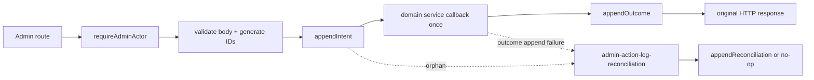
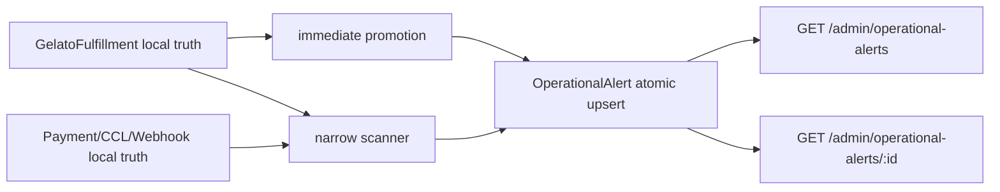

# Phase 12 SDD — Ops, Audit & Critical Tests

## 0. Gate do desenho

Este SDD descreve um desenho executável, mas não autoriza implementação. Os dois blockers documentais foram corrigidos: `OperationalAlert.severity` usa o contrato canônico `low|medium|high|critical`, separado de `AdminActionLog.severity = info|warning|critical`, e o plano 12-01 inclui a atualização do teste que referencia literalmente a migration Gelato. O checker documental passou com 0 blockers e 0 warnings; revisão humana continua obrigatória.

## 1. Component diagram

### 1.1 Auditoria Admin — Strategy B



### 1.2 Alertas operacionais



## 2. Estrutura exata de arquivos

Nenhum arquivo além dos previstos abaixo pode ser criado sem novo blocker/revisão do plano.

### 2.1 Disposable PostgreSQL — 12-01

```text
apps/backend/scripts/run-disposable-postgres-tests.mjs
apps/backend/integration-tests/postgres/disposable-postgres-harness.ts
apps/backend/src/infrastructure/__tests__/disposable-postgres-harness.unit.spec.ts
apps/backend/src/modules/webhooks/__tests__/disposable-postgres-harness.spec.ts
apps/backend/src/modules/gelato-fulfillment/migrations/TBD-gelato-fulfillment.ts
apps/backend/src/modules/gelato-fulfillment/migrations/Migration20260703000000.ts
apps/backend/src/modules/gelato-fulfillment/__tests__/gelato-fulfillment.unit.spec.ts
```

O rename modifica o path da migration, o nome da classe exportada e somente a referência literal correspondente no teste unitário; todas as demais asserções e o DDL factual permanecem inalterados.

### 2.2 OperationalAlert e Admin GET — 12-02

```text
apps/backend/src/modules/operational-alert/models/operational-alert.ts
apps/backend/src/modules/operational-alert/migrations/Migration20260720000100.ts
apps/backend/src/modules/operational-alert/service.ts
apps/backend/src/modules/operational-alert/index.ts
apps/backend/src/modules/operational-alert/__tests__/operational-alert.postgres.spec.ts
apps/backend/src/api/admin/operational-alerts/route.ts
apps/backend/src/api/admin/operational-alerts/[id]/route.ts
apps/backend/integration-tests/http/admin-operational-alerts.spec.ts
apps/backend/medusa-config.ts
```

### 2.3 Alert detection — 12-03

```text
apps/backend/src/modules/operational-alert/detectors.ts
apps/backend/src/modules/operational-alert/__tests__/operational-alert-detectors.unit.spec.ts
apps/backend/src/jobs/operational-alert-scanner.ts
apps/backend/src/jobs/__tests__/operational-alert-scanner.unit.spec.ts
apps/backend/src/jobs/gelato-dispatch-relay.ts
apps/backend/src/jobs/__tests__/gelato-dispatch-relay.unit.spec.ts
apps/backend/src/modules/checkout-completion/service.ts
apps/backend/src/modules/checkout-completion/__tests__/checkout-completion-log.unit.spec.ts
```

### 2.4 AdminActionLog primitives — 12-04

```text
apps/backend/src/modules/admin-action-log/models/admin-action-log.ts
apps/backend/src/modules/admin-action-log/migrations/Migration20260720000200.ts
apps/backend/src/modules/admin-action-log/service.ts
apps/backend/src/modules/admin-action-log/index.ts
apps/backend/src/modules/admin-action-log/__tests__/admin-action-log.postgres.spec.ts
apps/backend/src/jobs/admin-action-log-reconciliation.ts
apps/backend/src/jobs/__tests__/admin-action-log-reconciliation.unit.spec.ts
apps/backend/src/api/admin/_shared/require-admin-actor.ts
apps/backend/src/api/admin/_shared/audit-admin-action.ts
apps/backend/src/api/admin/_shared/__tests__/audit-admin-action.unit.spec.ts
```

São 10 arquivos; tabelas antigas do DISCUSSION-LOG que dizem 8 são históricas.

### 2.5 Admin instrumentation — 12-05

```text
apps/backend/medusa-config.ts
apps/backend/src/api/admin/refunds/request/route.ts
apps/backend/src/api/admin/exchanges/route.ts
apps/backend/src/api/admin/exchanges/[id]/route.ts
apps/backend/src/modules/refund-request/service.ts
apps/backend/src/modules/exchange-request/service.ts
apps/backend/src/modules/exchange-request/types.ts
apps/backend/integration-tests/http/admin-refunds.spec.ts
apps/backend/integration-tests/http/admin-exchanges.spec.ts
```

### 2.6 Invariant suites — 12-06

```text
apps/backend/integration-tests/http/invariants-inv01-02-order-birth.spec.ts
apps/backend/integration-tests/http/invariants-inv03-04-webhook-idempotency.spec.ts
apps/backend/integration-tests/http/invariants-inv08-gelato-single-active.spec.ts
apps/backend/integration-tests/http/invariants-inv09-10-refund-decoupling.spec.ts
apps/backend/src/modules/webhooks/__tests__/webhook-event-log.postgres.spec.ts
apps/backend/src/modules/checkout-completion/__tests__/checkout-completion-log.postgres.spec.ts
apps/backend/src/modules/gelato-fulfillment/__tests__/gelato-fulfillment.postgres.spec.ts
```

## 3. OperationalAlert schema físico

### 3.1 Identidade

- módulo/DI: `operational_alert`;
- model/table: `operational_alert`;
- ID prefix: `opalert` (`opalert_*`);
- migration: `Migration20260720000100` em `Migration20260720000100.ts`;
- unique lógico: `UQ_operational_alert_logical_key`.

### 3.2 Colunas

| Coluna | PostgreSQL | Medusa | Null | Default | Constraint/observação |
|---|---|---|---:|---|---|
| `id` | `text` | `model.id({prefix:"opalert"})` | não | gerado | PK `operational_alert_pkey` |
| `type` | `text` | `model.enum(...)` | não | — | check 2 tipos |
| `severity` | `text` | `model.enum(["low", "medium", "high", "critical"])` | não | — | check `low|medium|high|critical` |
| `status` | `text` | `model.enum(...)` | não | `open` | check 4 statuses |
| `entity_type` | `text` | `model.enum(...)` | não | — | check `payment_attempt|fulfillment` |
| `entity_id` | `text` | `model.text()` | não | — | trim não vazio; length <=128 |
| `message_code` | `text` | `model.text()` | não | — | código allowlisted, <=128 |
| `message` | `text` | `model.text()` | não | — | texto saneado, <=500 |
| `error_code` | `text` | `model.text().nullable()` | sim | null | saneado, <=128 |
| `metadata` | `jsonb` | `model.json().nullable()` | sim | null | objeto allowlisted |
| `first_seen_at` | `timestamptz` | `model.dateTime()` | não | `now()` | imutável no upsert |
| `last_seen_at` | `timestamptz` | `model.dateTime()` | não | `now()` | nunca regride |
| `occurrence_count` | `integer` | `model.number()` | não | `1` | check `>=1` |
| `acknowledged_at` | `timestamptz` | nullable dateTime | sim | null | suporte futuro |
| `acknowledged_by` | `text` | nullable text | sim | null | suporte futuro, ID interno |
| `resolved_at` | `timestamptz` | nullable dateTime | sim | null | suporte futuro |
| `resolved_by` | `text` | nullable text | sim | null | suporte futuro |
| `ignored_at` | `timestamptz` | nullable dateTime | sim | null | suporte futuro |
| `ignored_by` | `text` | nullable text | sim | null | suporte futuro |
| `created_at` | `timestamptz` | managed | não | `now()` | — |
| `updated_at` | `timestamptz` | managed | não | `now()` | atualizado no upsert |
| `deleted_at` | `timestamptz` | managed nullable | sim | null | compatibilidade Medusa; sem API de delete e fora da resposta |

`sent_at` é excluído: alert email está fora de escopo e não há transição que o consuma. A coluna `deleted_at` permanece apenas porque os modelos Medusa gerenciados esperam o campo; o service não expõe soft-delete.

### 3.3 Checks, unique e índices

```text
CK_operational_alert_type
CK_operational_alert_severity CHECK (severity IN ('low', 'medium', 'high', 'critical'))
CK_operational_alert_status
CK_operational_alert_entity_type
CK_operational_alert_entity_id
CK_operational_alert_occurrence_count
UQ_operational_alert_logical_key (type, entity_type, entity_id)
IDX_operational_alert_status_severity (status, severity)
IDX_operational_alert_entity (entity_type, entity_id)
IDX_operational_alert_type_last_seen (type, last_seen_at DESC)
IDX_operational_alert_last_seen_id (last_seen_at DESC, id DESC)
```

Unique é total, sem predicate de `deleted_at`.

## 4. OperationalAlert atomic upsert

Uma única instrução parametrizada; não há read-modify-write em memória:

```sql
INSERT INTO operational_alert (
  id, type, severity, status, entity_type, entity_id,
  message_code, message, error_code, metadata,
  first_seen_at, last_seen_at, occurrence_count,
  created_at, updated_at
) VALUES (
  :id, :type, :severity, 'open', :entity_type, :entity_id,
  :message_code, :message, :error_code, CAST(:metadata AS jsonb),
  :observed_at, :observed_at, 1,
  :observed_at, :observed_at
)
ON CONFLICT (type, entity_type, entity_id)
DO UPDATE SET
  severity = CASE
    WHEN CASE EXCLUDED.severity
      WHEN 'low' THEN 1 WHEN 'medium' THEN 2 WHEN 'high' THEN 3 WHEN 'critical' THEN 4 END
      > CASE operational_alert.severity
      WHEN 'low' THEN 1 WHEN 'medium' THEN 2 WHEN 'high' THEN 3 WHEN 'critical' THEN 4 END
    THEN EXCLUDED.severity ELSE operational_alert.severity END,
  status = CASE
    WHEN operational_alert.status IN ('resolved', 'ignored') THEN 'open'
    ELSE operational_alert.status END,
  message_code = EXCLUDED.message_code,
  message = EXCLUDED.message,
  error_code = EXCLUDED.error_code,
  metadata = EXCLUDED.metadata,
  last_seen_at = GREATEST(operational_alert.last_seen_at, EXCLUDED.last_seen_at),
  occurrence_count = operational_alert.occurrence_count + 1,
  acknowledged_at = CASE WHEN operational_alert.status IN ('resolved','ignored') THEN NULL ELSE operational_alert.acknowledged_at END,
  acknowledged_by = CASE WHEN operational_alert.status IN ('resolved','ignored') THEN NULL ELSE operational_alert.acknowledged_by END,
  resolved_at = CASE WHEN operational_alert.status IN ('resolved','ignored') THEN NULL ELSE operational_alert.resolved_at END,
  resolved_by = CASE WHEN operational_alert.status IN ('resolved','ignored') THEN NULL ELSE operational_alert.resolved_by END,
  ignored_at = CASE WHEN operational_alert.status IN ('resolved','ignored') THEN NULL ELSE operational_alert.ignored_at END,
  ignored_by = CASE WHEN operational_alert.status IN ('resolved','ignored') THEN NULL ELSE operational_alert.ignored_by END,
  updated_at = GREATEST(operational_alert.updated_at, EXCLUDED.updated_at)
RETURNING *;
```

Antes do SQL, o service constrói metadata somente com:

```text
payment_attempt_id, payment_intent_id, checkout_completion_log_id,
webhook_event_log_id, fulfillment_id, order_id,
detector_code, source_status, operator_alert_code
```

Valores não string/boolean/number finitos, chaves desconhecidas e strings acima de 128 caracteres são descartados/rejeitados antes da persistência.

## 5. AdminActionLog schema físico

### 5.1 Identidade

- módulo/DI: `admin_action_log`;
- model/table: `admin_action_log`;
- ID prefix: `admact`;
- migration: `Migration20260720000200`;
- imutabilidade: trigger PostgreSQL.

### 5.2 Colunas

| Coluna | PostgreSQL | Medusa | Null | Default | Check/semântica |
|---|---|---|---:|---|---|
| `id` | text | model.id prefix admact | não | gerado | PK |
| `action_attempt_id` | text | text | não | — | trim não vazio, <=128 |
| `correlation_id` | text | text | não | — | trim não vazio, <=128 |
| `audit_stage` | text | enum | não | — | intent/outcome/reconciliation |
| `admin_id` | text | text | não | — | actor user, <=128 |
| `admin_email` | text | nullable text | sim | null | opcional, não exposto por API nesta fase |
| `action` | text | enum | não | — | 4 action codes |
| `entity_type` | text | enum | não | — | refund_request/exchange_request |
| `entity_id` | text | text | não | — | ID interno, <=128 |
| `result` | text | enum | não | — | requested/succeeded/failed/blocked |
| `severity` | text | enum | não | `info` | info/warning/critical |
| `reason` | text | nullable text | sim | null | saneado, <=500 |
| `previous_state` | jsonb | nullable json | sim | null | snapshot allowlisted |
| `new_state` | jsonb | nullable json | sim | null | snapshot allowlisted |
| `metadata` | jsonb | nullable json | sim | null | allowlist |
| `idempotency_key` | text | nullable text | sim | null | não unique, <=255 |
| `created_at` | timestamptz | managed | não | now() | idade do intent |
| `updated_at` | timestamptz | managed | não | now() | igual ao created_at; UPDATE rejeitado |
| `deleted_at` | timestamptz | managed nullable | sim | null | sempre null; soft-delete é UPDATE e o trigger rejeita |

Checks adicionais:

- stage `intent` exige `result=requested`;
- stage `reconciliation` não aceita actor/campos diferentes do intent correspondente no service;
- JSON deve ser objeto ou null;
- nenhuma uniqueness em `correlation_id` ou `idempotency_key`.

### 5.3 Índices e constraints

```sql
CREATE UNIQUE INDEX "UQ_admin_action_log_attempt_intent"
ON admin_action_log (action_attempt_id)
WHERE audit_stage = 'intent';

CREATE UNIQUE INDEX "UQ_admin_action_log_attempt_terminal"
ON admin_action_log (action_attempt_id)
WHERE audit_stage IN ('outcome', 'reconciliation');
```

Índices de consulta:

```text
IDX_admin_action_log_actor_created (admin_id, created_at DESC)
IDX_admin_action_log_entity_created (entity_type, entity_id, created_at DESC)
IDX_admin_action_log_attempt_created (action_attempt_id, created_at)
IDX_admin_action_log_correlation_created (correlation_id, created_at)
IDX_admin_action_log_idempotency_key (idempotency_key) WHERE idempotency_key IS NOT NULL
IDX_admin_action_log_orphan_scan (audit_stage, created_at, id) WHERE audit_stage='intent'
```

### 5.4 Append-only trigger e down migration

```sql
CREATE FUNCTION reject_admin_action_log_mutation()
RETURNS trigger LANGUAGE plpgsql AS $$
BEGIN
  RAISE EXCEPTION 'ADMIN_ACTION_LOG_APPEND_ONLY'
    USING ERRCODE = '55000';
END;
$$;

CREATE TRIGGER "TRG_admin_action_log_append_only"
BEFORE UPDATE OR DELETE ON admin_action_log
FOR EACH ROW EXECUTE FUNCTION reject_admin_action_log_mutation();
```

Down, nesta ordem:

```sql
DROP TRIGGER IF EXISTS "TRG_admin_action_log_append_only" ON admin_action_log;
DROP FUNCTION IF EXISTS reject_admin_action_log_mutation();
DROP TABLE IF EXISTS admin_action_log CASCADE;
```

Conflito do unique de intent/terminal é esperado: o service recupera `retrieveIntent`/`retrieveTerminalFact` pelo `action_attempt_id` e devolve a linha canônica; não faz overwrite.

## 6. Interfaces dos services

```ts
type AlertType = "payment_stuck" | "fulfillment_failed"
type OperationalAlertSeverity =
  | "low"
  | "medium"
  | "high"
  | "critical"
type AlertStatus = "open" | "acknowledged" | "resolved" | "ignored"

type UpsertAlertInput = {
  type: AlertType
  severity: OperationalAlertSeverity
  entity_type: "payment_attempt" | "fulfillment"
  entity_id: string
  message_code: string
  message: string
  error_code?: string | null
  metadata?: OperationalAlertMetadata | null
  observed_at: Date
}

type ListSafeInput = {
  type?: AlertType
  status?: AlertStatus
  severity?: OperationalAlertSeverity
  entity_type?: "payment_attempt" | "fulfillment"
  entity_id?: string
  last_seen_at_from?: Date
  last_seen_at_to?: Date
  limit: number
  offset: number
}

interface OperationalAlertService {
  upsertAlert(input: UpsertAlertInput): Promise<OperationalAlertSafe>
  listSafe(input: ListSafeInput): Promise<{ rows: OperationalAlertSafe[]; count: number }>
  retrieveSafe(id: string): Promise<OperationalAlertSafe | null>
}
```

```ts
type AuditStage = "intent" | "outcome" | "reconciliation"
type AuditResult = "requested" | "succeeded" | "failed" | "blocked"
type AdminAction =
  | "refund_order"
  | "update_exchange"
  | "reject_exchange"
  | "cancel_exchange"

type AppendIntentInput = CommonAuditInput & {
  audit_stage: "intent"
  result: "requested"
}

type AppendOutcomeInput = CommonAuditInput & {
  audit_stage: "outcome"
  result: AuditResult
}

type AppendReconciliationInput = CommonAuditInput & {
  audit_stage: "reconciliation"
  result: "requested" | "succeeded" | "failed" | "blocked"
}

interface AdminActionLogService {
  appendIntent(input: AppendIntentInput): Promise<AdminActionFact>
  appendOutcome(input: AppendOutcomeInput): Promise<AdminActionFact>
  appendReconciliation(input: AppendReconciliationInput): Promise<AdminActionFact>
  listOrphanIntents(input: {
    created_before: Date
    after?: { created_at: Date; id: string }
    limit: number
  }): Promise<AdminActionFact[]>
  retrieveTerminalFact(actionAttemptId: string): Promise<AdminActionFact | null>
}
```

`CommonAuditInput` contém somente IDs, enums, reason saneada, snapshots e metadata allowlisted; nunca request/body/payload bruto.

## 7. Actor guard e audit helper

```ts
type AdminActor = {
  actor_type: "user"
  actor_id: string
}

function requireAdminActor(
  req: Pick<MedusaRequest, "auth_context">
): AdminActor
```

```ts
type AuditActionDescriptor<TDomain> = {
  action_attempt_id: string
  correlation_id: string
  idempotency_key?: string | null
  actor: AdminActor
  action: AdminAction
  entity_type: "refund_request" | "exchange_request"
  entity_id: string
  intent_reason?: string | null
  intent_metadata?: AuditMetadata | null
  classifySuccess(result: TDomain): {
    result: "requested" | "succeeded"
    previous_state?: AuditState | null
    new_state?: AuditState | null
    metadata?: AuditMetadata | null
  }
  classifyDomainError(error: unknown): "failed" | "blocked"
}

async function auditAdminAction<TDomain>(input: {
  audit: AdminActionLogService
  logger: SanitizedLogger
  descriptor: AuditActionDescriptor<TDomain>
  executeDomain: () => Promise<TDomain>
}): Promise<TDomain>
```

Algoritmo:

1. append intent;
2. se falhar, lançar erro saneado e não chamar callback;
3. guardar `domainCalled=false`, marcar true imediatamente antes de `await executeDomain()`;
4. se domínio falhar, tentar append outcome failed/blocked e relançar erro original saneado;
5. se domínio suceder, tentar append outcome factual;
6. se outcome falhar, logar código/IDs internos e retornar o resultado do domínio;
7. não há loop/retry do callback; uma invocação do helper chama `executeDomain` no máximo uma vez.

## 8. Jobs

### 8.1 `operational-alert-scanner`

```text
cron: */5 * * * *
worker-only: WORKER_MODE === worker
release migration: no-op se isReleaseMigrationMode()
batch size: 100
max pages/run: 20
max candidates/run: 2000 por fonte
timeout budget: 25 segundos
pagination: keyset estável por (updated source timestamp, id)
```

Processa fontes independentemente. Falha de uma página é registrada com `job`, `source`, `page`, `error_code` saneados; a fonte falha encerra nesta execução e as demais podem continuar. Cada candidato passa por detector puro; somente DTO positivo chama upsert. Sem provider.

### 8.2 `admin-action-log-reconciliation`

```text
cron: */5 * * * *
ADMIN_ACTION_ORPHAN_AFTER_MS: 15 * 60_000
worker-only: WORKER_MODE === worker
release migration: no-op
batch size: 100
max pages/run: 20
timeout budget: 25 segundos
pagination: keyset (intent.created_at, intent.id)
```

Dois workers podem listar o mesmo intent. Ambos consultam terminal antes do domínio local e novamente tratam conflito terminal; nenhum chama provider. Uma página com falha não avança o cursor daquela página e encerra o job com log saneado, preservando retry no próximo cron. Terminal já existente é no-op.

## 9. Disposable PostgreSQL lifecycle

### 9.1 Caminho Docker

```text
runner externo
→ valida que Docker está disponível
→ gera container p12-pg-<token>, porta loopback efêmera e senha efêmera
→ inicia imagem postgres aprovada com maintenance database postgres
→ readiness via docker exec <id> pg_isready -U <user> -d postgres
→ gera DB_TEMP_NAME=p12_disposable_<token>
→ exporta maintenance URL sanitizada + DB_TEMP_NAME separado
→ invoca Jest
→ medusaIntegrationTestRunner({dbName: process.env.DB_TEMP_NAME}) cria/migra/usa/remove o DB
→ runner consulta pg_database pelo maintenance DB e exige ausência de DB_TEMP_NAME
→ finally remove o container pelo ID exato
```

Runner externo nunca cria/dropa `DB_TEMP_NAME`. Medusa é o único owner do database alvo.

### 9.2 DSN alternativa

Entradas separadas:

```text
P12_DISPOSABLE_DATABASE_URL=<maintenance URL loopback>
P12_DISPOSABLE_DB_NAME=p12_disposable_<token>
```

Validações fail-closed antes de qualquer operação destrutiva:

- protocolo `postgres:`/`postgresql:`;
- hostname exatamente `localhost`, `127.0.0.1` ou `::1`;
- database de manutenção não vazio e diferente do target;
- target casa `^p12_disposable_[a-z0-9_]+$`, tamanho <=63;
- target não é `postgres`, `template0`, `template1`, database atual nem nome vazio;
- nenhuma interpolação sem quoting/parameterização;
- URL/senha não entram em logs;
- ausência de infra é `BLOCKED`, nunca skip.

Sinais `SIGINT`, `SIGTERM`, timeout ou Jest failure passam pelo mesmo finally. Resíduo é listado/removido apenas por ID/nome exato validado, nunca glob.

## 10. Migration discovery e module registration

### 10.1 Ordem esperada

1. migrations já descobertas WebhookEventLog (`Migration20260701000000`);
2. CheckoutCompletionLog (`Migration20260702000000`);
3. GelatoFulfillment (`Migration20260703000000`), por rename do draft com classe homônima, atualização da referência literal no teste unitário e DDL idêntico;
4. OperationalAlert `Migration20260720000100`;
5. AdminActionLog `Migration20260720000200`.

O rename Gelato deve atualizar a classe exportada `MigrationTBDGelatoFulfillment` para `Migration20260703000000` e substituir, em `apps/backend/src/modules/gelato-fulfillment/__tests__/gelato-fulfillment.unit.spec.ts`, qualquer referência literal a `TBD-gelato-fulfillment.ts` ou `MigrationTBDGelatoFulfillment`. Todas as demais asserções do teste são preservadas, assim como o DDL factual da migration.

### 10.2 Wiring test-only

O spec PostgreSQL AdminActionLog usa `medusaIntegrationTestRunner` e, em `hooks.beforeServerStart`, resolve `ContainerRegistrationKeys.CONFIG_MODULE` e adiciona exclusivamente:

```ts
configModule.modules.admin_action_log = {
  resolve: "./src/modules/admin-action-log",
}
```

Isso ocorre antes de `initializeDatabase`, `migrateDatabase` e `runModulesMigrations`.

### 10.3 Wiring runtime

`medusa-config.ts` recebe somente:

```ts
{ key: "operational_alert", resolve: "./src/modules/operational-alert" }
{ key: "admin_action_log", resolve: "./src/modules/admin-action-log" }
```

Não se altera Redis, cache, event bus, workflow engine, locking, database, providers, health, worker mode ou release migration mode.

## 11. Route sequencing

### 11.1 Refund request

1. `requireAdminActor`;
2. validate feature flag e body; rejeitar campos de operador client-supplied;
3. gerar `RefundRequest.id`, `action_attempt_id`, `correlation_id`; preservar idempotency key válida;
4. derivar intent `refund_order/refund_request/<id>`;
5. append intent;
6. callback uma vez: recuperar Order/PaymentAttempt, calcular disponibilidade e reservar/criar pelo ID pré-gerado;
7. derivar outcome: `requested`, `blocked` ou `failed`;
8. append terminal ou deixar órfão segundo Strategy B;
9. devolver exatamente o status/body anterior (`201` novo, `200` replay) em sucesso.

Snapshot before é `{}` imediatamente antes do intent; after é capturado da `RefundRequest` persistida, reduzido a status/amount/currency.

### 11.2 Exchange create

1. actor;
2. feature flag/body/allowlist;
3. gerar ExchangeRequest ID e IDs de audit;
4. append `update_exchange` intent;
5. callback uma vez cria pelo ID e actor autenticado;
6. after snapshot do registro persistido;
7. append succeeded/blocked/failed;
8. retornar status/body original.

### 11.3 Exchange update

1. actor;
2. feature flag, ID e body;
3. recuperar registro atual e capturar previous allowlisted;
4. derivar action factual pelo delta;
5. gerar IDs e append intent;
6. callback uma vez aplica transição;
7. capturar new state do registro persistido;
8. append terminal;
9. retornar status/body original.

## 12. Concurrency design

| Cenário | Autoridade | Cardinalidade/resultado |
|---|---|---|
| dois upserts do mesmo alerta | unique total + ON CONFLICT | 1 linha, occurrence +2 no total, maior severity pela ordem `low=1 < medium=2 < high=3 < critical=4`, first_seen preservado |
| dois intents do mesmo attempt | unique parcial intent | 1 intent canônico |
| dois outcomes | unique parcial terminal | 1 terminal canônico |
| outcome vs reconciliation | mesmo unique terminal | 1 vencedor; perdedor recupera vencedor |
| dois workers no mesmo órfão | consulta + unique terminal | 1 reconciliation no máximo |
| retry funcional | novo action_attempt_id | novo intent + até 1 terminal; fatos antigos imutáveis |
| mesma idempotency key em attempts diferentes | sem unique global | permitido; cada attempt mantém cardinalidade própria; metadata marca reuse |

PostgreSQL define a ordem por chave/constraint, não uma ordem global entre chaves. Cross-dyno real não é testado; a segurança multi-processo é inferida exclusivamente da constraint compartilhada.

## 13. Test architecture

| Requisito | Arquivo | Nível | Fixtures/banco/mocks | Assertions e negative proof |
|---|---|---|---|---|
| TEST-01 harness | `disposable-postgres-harness.unit.spec.ts` | unit | URLs/nomes/sinais falsos | recusa host/name, redaction, cleanup |
| TEST-01 harness | `disposable-postgres-harness.spec.ts` | PostgreSQL | DB_TEMP_NAME real | discovery, isolamento, ausência residual |
| TEST-01 rename Gelato | `gelato-fulfillment.unit.spec.ts` | unit focado | migration renomeada | referência literal atualizada, classe timestamped e demais asserções preservadas |
| OPS-01 schema/upsert | `operational-alert.postgres.spec.ts` | PostgreSQL | módulo test DB | enum `low|medium|high|critical`, promoção 1..4, DDL, checks, unique, concorrência, reopen, sanitização |
| OPS-01 API | `admin-operational-alerts.spec.ts` | HTTP flat | auth/Admin + módulo double/DB | filtros, defaults, max, order, 400/404, allowlist, sem mutação |
| OPS-01 predicates | `operational-alert-detectors.unit.spec.ts` | unit | clock table | `payment_stuck=high`, operator attention/stale=`high`, dead_letter=`critical`; branches negativos; nunca updated_at |
| OPS-01 scanner | `operational-alert-scanner.unit.spec.ts` | unit | module doubles | cron, page, mappings `high|critical`, no-op, no provider, failure isolation |
| OPS-01 Gelato | `gelato-dispatch-relay.unit.spec.ts` | unit | Gelato service double | dead_letter=`critical`; operator attention/stale=`high`; persist truth antes de alert; alert fail não reverte |
| OPS-01 CCL | `checkout-completion-log.unit.spec.ts` | unit | clock | payment_stuck=`high`; failed imediato, processing 15m, fresh não reclaim |
| OPS-02 schema | `admin-action-log.postgres.spec.ts` | PostgreSQL | module via beforeServerStart | checks, 2 unique parciais, trigger, 6 races |
| OPS-02 job | `admin-action-log-reconciliation.unit.spec.ts` | unit | refund/exchange doubles | 15m, paging, facts only, absence remains orphan, no provider |
| OPS-02 helper | `audit-admin-action.unit.spec.ts` | unit | spies | actor, order, failure matrix, callback <=1 |
| OPS-02 refund | `admin-refunds.spec.ts` | HTTP flat | auth/domain/audit doubles | requested, 201/200, actor spoof negative, success preserved |
| OPS-02 exchange | `admin-exchanges.spec.ts` | HTTP flat | auth/domain/audit doubles | actions, snapshots, failures, no approve/reprocess |
| INV-1/2 | `invariants-inv01-02-order-birth.spec.ts` | HTTP flat | webhook/payment doubles | only canonical confirmation; five Pix states zero Order |
| INV-3/4 | `invariants-inv03-04-webhook-idempotency.spec.ts` | HTTP flat | signatures + DB doubles | fail before DB; replay one logical fact |
| INV-8 | `invariants-inv08-gelato-single-active.spec.ts` | HTTP flat | Gelato provider double | double trigger one active |
| INV-9/10 | `invariants-inv09-10-refund-decoupling.spec.ts` | HTTP flat | Stripe webhook doubles | refund object only; order status unchanged |
| INV-4 PG | `webhook-event-log.postgres.spec.ts`, `checkout-completion-log.postgres.spec.ts` | PostgreSQL | concurrent promises/transactions | unique/claim canonical |
| INV-8 PG | `gelato-fulfillment.postgres.spec.ts` | PostgreSQL | concurrent insert/claim | single active per Order |

Specs HTTP permanecem diretamente em `integration-tests/http/`; nenhum Jest config é alterado. Provider calls são mocks/doubles e há negativa explícita de rede.

## 14. Configuration diff

Allowlist cumulativa em `apps/backend/medusa-config.ts`:

```text
operational_alert
admin_action_log
```

Qualquer diff em Redis, cache, event bus, workflow, locking, database, provider, health ou migration mode é blocker. Package, lockfile e Jest config devem ter diff vazio no intervalo `PHASE12_EXECUTION_BASE_SHA...HEAD`.

## 15. Failure recovery e rollback

| Falha | Recovery | Rollback limitado |
|---|---|---|
| intent órfão | job após 15m anexa fato apenas se inequívoco | nunca editar/apagar intent |
| resíduo DB/container | finally + verificação por ID/nome exato | remover alvo validado; nunca glob |
| migration local falha | runner marca BLOCKED e remove DB/container | down apenas no DB descartável |
| scanner falha | log saneado, próxima execução reprocessa por upsert | remover job/detectors; alertas persistidos ficam |
| alert upsert falha | verdade Gelato/payment preservada, backstop posterior | reverter integração sem alterar domínio |
| audit outcome falha | sucesso HTTP preservado, orphan reconciliation | não repetir domínio |
| plano 12-01 | quatro arquivos de harness removidos; path `TBD`, classe antiga e referência literal original do teste restaurados | nenhum outro teste é alterado; DDL factual permanece equivalente |
| plano 12-02 | remover módulo/rotas/config e down da tabela | sem provider externo |
| plano 12-03 | remover scanner/detectors e reverter relay/CCL | sem apagar alertas |
| plano 12-04 | remover helpers/job/módulo e down trigger/function/table | sem alterar refund/exchange |
| plano 12-05 | reverter wrappers/assinaturas/config | fatos já gravados imutáveis |
| plano 12-06 | remover somente specs novos | sem rollback runtime |

Não existe rollback externo: nenhuma chamada real, deploy, migration remota ou produção pertence à fase.

## 16. Traceability integral

| SPEC/SDD seção | Plano | Task | Requirement | Validation |
|---|---|---|---|---|
| SDD §9 | 12-01 | T1 runner/guards | TEST-01 | harness unit + negative target/cleanup |
| SDD §9-10,13 | 12-01 | T2 migration discovery/rename | TEST-01 | teste unitário Gelato focado + referência literal atualizada + disposable PG smoke/catalog |
| SPEC §2 / SDD §3 | 12-02 | T1 contract/model/config | OPS-01 | enum `low|medium|high|critical`; build/schema/module resolution |
| SPEC §2 / SDD §4 | 12-02 | T2 migration/upsert | OPS-01 | promoção `low=1..critical=4`; operational-alert PostgreSQL spec |
| SPEC §3 / SDD §13 | 12-02 | T3 Admin GET | OPS-01 | admin-operational-alerts HTTP |
| SPEC §4-5 | 12-03 | T1 predicates | OPS-01 | mappings `payment_stuck=high`, operator attention/stale=`high`, dead_letter=`critical` no detector decision-table unit |
| SPEC §4-5 / SDD §8 | 12-03 | T2 scanner | OPS-01 | scanner unit cron/page/no-op |
| SPEC §4-5 / SDD §15 | 12-03 | T3 immediate promotion/CCL | OPS-01 | Gelato + CCL units |
| SPEC §7 / SDD §5 | 12-04 | T1 schema append-only | OPS-02 | PG catalog/check/trigger |
| SPEC §10 / SDD §8,12 | 12-04 | T2 service/reconciliation | OPS-02 | job unit + six PG concurrency cases |
| SPEC §6,9 / SDD §7 | 12-04 | T3 actor/helper | OPS-02 | audit helper unit failure matrix |
| SPEC §8.1 / SDD §11.1 | 12-05 | T1 refund | OPS-02 | admin-refunds HTTP |
| SPEC §8.2 / SDD §11.2 | 12-05 | T2 exchange create | OPS-02 | admin-exchanges HTTP |
| SPEC §8.3 / SDD §11.3 | 12-05 | T3 exchange update/native inventory | OPS-02 | HTTP + 3 IN/76 OUT traversal |
| SPEC §11 / SDD §13 | 12-06 | T1 INV-1/2/3/4 | TEST-01 | two named flat HTTP specs |
| SPEC §11 / SDD §13 | 12-06 | T2 INV-8/9/10 | TEST-01 | two named flat HTTP specs |
| SDD §12-15 | 12-06 | T3 PostgreSQL/final gate | TEST-01, OPS-01, OPS-02 | PG constraints + full focused matrix + SHA negatives |

Cobertura: 17/17 tasks. Os dois blockers documentais foram resolvidos sem ampliar o escopo de implementação.

## 17. Resultado do desenho

O desenho está especificado e o checker documental retorna **PASS**, com 0 blockers e 0 warnings. O resultado não é `PASS WITH KNOWN DEBTS`. Nenhum implementation prompt ou plano pode ser executado antes da revisão humana.
