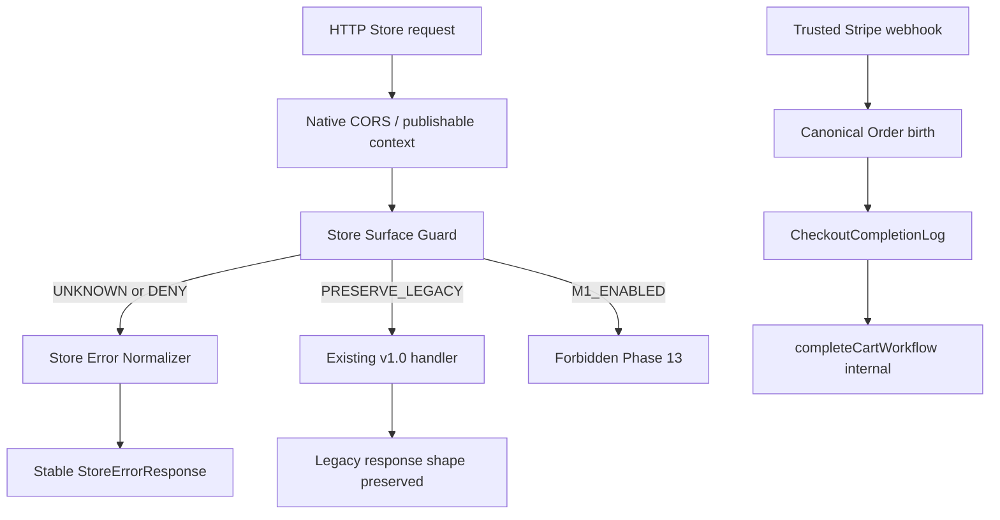
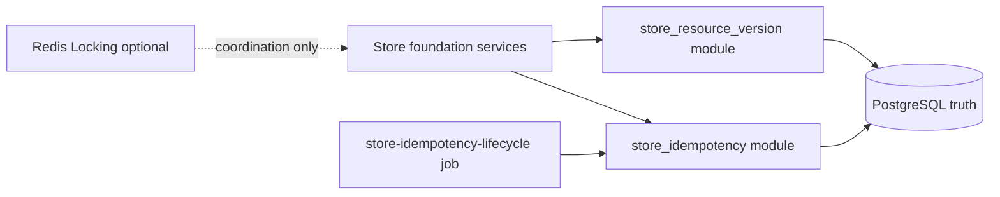

# Phase 13 SDD — Storefront Contract Foundation & Surface Lockdown

## 0. Gate do desenho

Este SDD descreve **como** a implementação futura será estruturada. Não autoriza
código, testes, migrations, OpenAPI writer, package/lockfile, provider, deploy
ou frontend.

Autoridade de comportamento observável: `13-SPEC.md`.
Autoridade de tasks/files/validações: PLANs R5 `13-01..13-07`.
Precedência: CONTEXT D13-* > PLAN R5 > VALIDATION > RESEARCH > as-built.

Rotulagem: `AS-BUILT` | `APPROVED TARGET` | `FUTURE OWNER-PHASE` | `EXECUTION-TIME FACT`.

---

## 1. Component architecture

### 1.1 Runtime Store request path (`APPROVED TARGET`)

```text
HTTP request
   |
   v
Native Store CORS / publishable context   (AS-BUILT; preserved, not authorization)
   |
   v
Store Surface Guard  (/store* matcher, method-aware)
   |
   +--> UNKNOWN / DENY ------------------> Store Error Normalizer --> response
   |                                         (zero handler invocation)
   |
   +--> PRESERVE_LEGACY -----------------> existing allowed handler (v1.0 only)
   |
   +--> M1_ENABLED -----------------------> FORBIDDEN in Phase 13 (count=0)
   |
   v
(future owner-phase enabled operation)     FUTURE OWNER-PHASE — not materialized
```



Order-birth positivo permanece exclusivamente no webhook canônico
(`runCreateOrderFromConfirmedPaymentAttemptEntrypoint` — `AS-BUILT`).

### 1.2 Foundation persistence



---

## 2. Store surface manifest design

### 2.1 Conceptual types (`APPROVED TARGET`)

```text
StoreSurfaceClassification =
  AUTHORIZED | EXTENDED | BLOCKED | OUTSIDE_FRONTEND_M1

StoreRuntimePolicy =
  DENY | PRESERVE_LEGACY | M1_ENABLED

M1Enablement =
  disabled | enabled

OpenApiExpectation =
  include_executable_m1 | exclude | support_only

OpenApiExpectation semantics (canonical; identical to SPEC):
  include_executable_m1
    → operation belongs to executable M1 exact-set when all enablement
      conditions are satisfied
  exclude
    → operation must not appear as executable M1 business operation
  support_only
    → schema/header/component/support knowledge may exist without exposing
      a business path+method

Phase 13: include_executable_m1 business operations actually enabled = 0
PRESERVE_LEGACY remains outside the executable exact-set

StoreSurfaceEntry = {
  method: HTTP method uppercase
  pathTemplate: canonical /store/... template
  origin: native | local | native+local_extension
  medusaVersion: "2.16.0"
  classification: StoreSurfaceClassification
  runtime_policy: StoreRuntimePolicy
  m1_enablement: M1Enablement
  openapi_m1_expectation: OpenApiExpectation
  rationale: non-empty string
  owner_phase?: string
}
```

Single export / single source of truth:
`apps/backend/src/api/store-surface/manifest.ts` (future).
No parallel list in OpenAPI or elsewhere.

### 2.2 Validatable invariants

```text
exactly 58 entries
unique (method + canonical path template)
0 UNKNOWN / 0 unclassified
distribution AUTHORIZED/EXTENDED/BLOCKED/OUTSIDE = 0/10/17/31
required fields non-null
BLOCKED ⇒ runtime_policy DENY
M1_ENABLED policy count = 0 in Phase 13
m1_enablement enabled count = 0 in Phase 13
invalid combinations rejected by unit tests + scanner
DENY + PRESERVE_LEGACY counts sum to 58  (EXECUTION-TIME FACT from 13-01)
```

---

## 3. Installed route scanner

### 3.1 Future artifact

`apps/backend/scripts/store-surface/scan-installed.ts`

### 3.2 Inputs

| Source | Role |
|---|---|
| `@medusajs/medusa/dist/api/store/**/route.js` | native inventory (`AS-BUILT` = 51 ops / 44 files) |
| `apps/backend/src/api/store/**/route.ts` | local routes; non-overlapping = 7 |
| Manifest TS | expected exact-set |

### 3.3 Pipeline

```text
discover route exports
→ extract method + path
→ canonicalize
→ dedupe
→ compare with manifest
→ PASS only if exact-set match
→ else BLOCKED drift
```

### 3.4 Canonicalization rules

| Case | Rule |
|---|---|
| HEAD | never inferred from GET; must be explicit or DENY |
| OPTIONS | preflight-only when valid CORS; invalid fail-closed |
| trailing slash | normalize or DENY consistently with router; no silent alternate |
| double slash | reject / fail-closed |
| encoded separators | reject unexpected encodings |
| path params | template form `{id}` / `:id` canonicalized to one form used by manifest |
| static-vs-param precedence | follow Medusa/Express sorter; tests cover both |
| query string | ignored for identity; never authorizes |
| aliases | any non-canonical path → DENY + drift if unexpected |

Products local middleware extensions count as the same native path templates
(not extra overlapping operations).

---

## 4. Global Store guard

### 4.1 Preferred interception point

`AS-BUILT` (middleware registration surface only):
`apps/backend/src/api/middlewares.ts` uses `defineMiddlewares`; only
path-specific Store matchers exist; global matcher today is `/.*/`
correlation/access-log only — **no** `/store*` surface guard.

`APPROVED TARGET` (PLAN 13-02 + RESEARCH):

```text
Register Store Surface Guard with matcher "/store*"
without method restriction

APPROVED TARGET:
Store Surface Guard must execute before Store business handlers and before
any specific Store middleware whose execution would violate fail-closed behavior.
```

`EXECUTION-TIME FACT`:

```text
exact Medusa 2.16.0 middleware/router matcher ordering must be verified
during 13-02.
```

Stop condition (preserved):

```text
if factual Medusa 2.16.0 ordering prevents the approved interception model
→ 13-02 BLOCKED
```

No monkey patch of `node_modules`. No inventing framework precedence as
`AS-BUILT` without in-repo factual proof. Physical choice closed by PLAN:
middleware-primary + optional local override for
`POST /store/carts/{id}/complete`. Stop if override conflicts with loader 2.16.0
→ `13-02: BLOCKED`.

### 4.2 Lookup sequence

```text
1. determine route identity (method + canonical path template)
2. manifest lookup
3. if absent/UNKNOWN → DENY + drift signal
4. if runtime_policy DENY or classification BLOCKED → DENY
5. if PRESERVE_LEGACY → next() to existing handler
6. if M1_ENABLED → forbidden in Phase 13
```

### 4.3 DENY before handler

Denial must occur **before** business handler/workflow invocation.
Proof: handler spy + workflow spy (`completeCartWorkflow`) = 0 for DENY matrix.

### 4.4 Local defense for Order bypass

Future file:
`apps/backend/src/api/store/carts/[id]/complete/route.ts`
overrides native complete with stable DENY (defense-in-depth). Guard remains
primary control.

---

## 5. Error normalization architecture

### 5.1 Components (future)

```text
apps/backend/src/api/store-surface/errors.ts
  - StoreErrorResponse type
  - code catalog
  - toStoreErrorResponse(err, correlationId)
  - fieldErrors allowlist helpers

apps/backend/src/api/middlewares.ts
  - Store branch in errorHandler
  - reuse resolveCorrelationId allowlist AS-BUILT
```

### 5.2 Mapping rules

```text
known Medusa/validation/domain/auth errors → stable public codes/status
unknown/provider → generic 500/503 sanitized
retryable=true only when certain and no uncertain side effect
fieldErrors only for public field names
never echo raw body / stack / provider payload
```

### 5.3 Correlation propagation

Same sanitized ID → response header, error body, structured log, Sentry context.

### 5.4 Isolation

If `req.path` is Admin or Webhooks → **existing** handler path unchanged
(`AS-BUILT` delegation preserved). Store envelope never applied outside Store.

---

## 6. StoreIdempotency module design

### 6.1 Module

```text
module key: store_idempotency
path: apps/backend/src/modules/store-idempotency/
model: models/store-idempotency-record.ts
service: service.ts
index: index.ts
```

### 6.2 Responsibilities

| Layer | Responsibility |
|---|---|
| Model | columns, CHECKs, UNIQUE composite, indexes |
| Service | claim, load, fingerprint compare, transition, cleanup hooks |
| Hashing helper | HMAC-SHA-256 with STORE_IDEMPOTENCY_KEY_PEPPER; versions |
| Lifecycle job | due-row evaluation every minute |

### 6.3 Conceptual APIs

```text
claim(operation, actorScope, resourceScope, rawKey, fingerprint) → ClaimResult
replayIfSameIntent(record, fingerprint) → SafeReplay | Conflict
transition(recordId, fromState, toState, predicate) → boolean
fingerprint(canonicalSemanticObject) → string
markCompleted / markFailedRetryable / markFailedTerminal / markReconciliation*
cleanupExpiredTerminals(now)
```

### 6.4 Pseudocode (documentary — not runtime)

```text
CLAIM:
  hashKey = HMAC_SHA256(pepper, rawKey)  // byte-for-byte key
  BEGIN TX
    INSERT processing row with unique scope+key
    ON CONFLICT:
      SELECT FOR UPDATE existing
      IF fingerprint == existing.fingerprint:
        RETURN replay_or_in_progress(existing)
      ELSE:
        RETURN conflict_409  // zero side effect
    RETURN claimed
  COMMIT

SAME-INTENT REPLAY:
  IF state=completed → return allowlisted snapshot/status
  IF state=processing → stable in-progress retryable response
  IF state=failed_terminal → replay terminal error until expiry

INCOMPATIBLE-INTENT:
  RETURN 409 IDEMPOTENCY_KEY_REUSE_CONFLICT (name EXECUTION-TIME / catalog)
  NO new side effect

CONCURRENT WINNER:
  UNIQUE constraint + conditional claim → exactly one processing winner

RETRY:
  failed_retryable AND next_retry_at <= now AND attempts < 8 AND within 24h
  AND absence of uncertain external effect proven
  → reclaim processing
  ELSE terminalize or reconciliation_required

RECONCILIATION (resolution != retry; not an automatic retry queue):
  uncertain external effect → reconciliation_required
  IF reconciliation_required:
    IF review/evidence proves successful effect:
      transition → completed
    ELSE IF review/evidence proves terminal failure:
      transition → failed_terminal
    ELSE IF review_deadline_at <= now:
      transition → reconciliation_unresolved
    ELSE:
      remain reconciliation_required
  NEVER blind retry
  NEVER transition back to processing without a separately proven-safe
    recovery path already allowed by PLAN
  NEVER use reconciliation_required as automatic success/failure inference
  reconciliation_unresolved = terminal audit state
    (not financial truth / not provider success / not business success)

CLEANUP:
  DELETE only completed|failed_terminal|reconciliation_unresolved WHERE expires_at <= now
```

#### 6.4.1 Claim / `state_version` semantics

```text
state_version is lifecycle transition generation
  — NOT StoreResourceVersion.version

StoreIdempotencyRecord.state_version
→ protects idempotency lifecycle state transitions

StoreResourceVersion.version
→ protects application resource mutation concurrency
```

Claim strategies permitted by PLAN (exactly one lifecycle claimant; no lost transition):

```text
Strategy A:
  transaction + SELECT FOR UPDATE / row lock + expected state predicate

Strategy B:
  atomic conditional UPDATE
  WHERE id = ... AND state = expected_state AND state_version = expected_state_version
  SET state = ..., state_version = state_version + 1
  RETURNING ...
```

Never persist: raw Idempotency-Key, pepper, JWT, capability, CPF, client_secret,
Pix material, provider payload.

---

## 7. Lifecycle job design

### 7.1 Future file

`apps/backend/src/jobs/store-idempotency-lifecycle.ts`

Pattern (`AS-BUILT` jobs):

```text
export default async function handler(container) { ... }
export const config = {
  name: "store-idempotency-lifecycle",
  schedule: "* * * * *",
}
```

### 7.2 Flow

```text
scan due rows (state_deadline_at | next_retry_at | terminal expires_at)
→ transaction
→ claim with row lock OR state+state_version conditional predicate
→ exactly one worker owns transition
→ evaluate due state
→ persist transition/deadline
→ increment state_version when applicable
→ commit
```

PostgreSQL = correctness truth. Redis = optional coordination only.
Restart resumes due rows from PostgreSQL.

### 7.3 Concurrency / resilience

```text
two workers may observe
exactly one lifecycle claimant (row lock OR state+state_version predicate)
no lost transition
Redis outage must not affect correctness
restart resumes from PostgreSQL
no in-memory decision state
```

Phase 13 harness ops only:
`phase13.local-mutation`, `phase13.uncertain-effect-simulation`.
Owner phases supply real executors later.

---

## 8. StoreResourceVersion design

### 8.1 Module

```text
module key: store_resource_version
path: apps/backend/src/modules/store-resource-version/
```

### 8.2 Conceptual APIs

```text
initialize(resourceType, resourceId, sharedContext) → version=1 row
loadForUpdate(resourceType, resourceId, sharedContext) → row
compare(expected, actual) → ok | stale
increment(resourceType, resourceId, expected, sharedContext) → newVersion | stale
casWithMutation(expected, mutateFn, sharedContext) → result
```

### 8.3 Lazy bootstrap pseudocode

```text
BEGIN TX (shared manager)
  INSERT (type, id, version=1) ON CONFLICT DO NOTHING
  SELECT ... FOR UPDATE
  // version is now authoritative (>=1)
COMMIT / continue same TX for mutation
```

### 8.4 CAS pseudocode

```text
BEGIN TX sharedContext
  lock version row
  IF version != expected → ROLLBACK / stale (no mutation)
  mutateFn(sharedContext)  // Medusa protected mutation
  UPDATE version = version + 1 WHERE version = expected RETURNING version
  IF no row → ROLLBACK (must not leave partial)
COMMIT
```

Atomicity with Medusa mutation: **same transaction manager**, single commit
(Wave 0 proof authority from `13-01`). Do not design public Cart ETag response.

---

## 9. Transaction design

Authority: Wave 0 proof in `13-01`.

```text
same transaction manager
single commit
rollback both mutation and resource version
no two-commit fallback
no eventual compensation as atomicity substitute
```

| Failure case | Required result |
|---|---|
| mutation failure | no version change; no partial |
| version failure | no mutation retained |
| stale expected version | zero mutation; one winner elsewhere |
| concurrent writers | exactly one commit |
| Redis coordination failure | PostgreSQL CAS/unique still decides |

Probe table in Wave 0 is disposable — **not** a product migration.

---

## 10. Config design

### 10.1 `STORE_IDEMPOTENCY_KEY_PEPPER`

| Env | Rule |
|---|---|
| production | required; base64url; decoded ≥32 bytes; fail-fast |
| development/test | deterministic explicit behavior (documented in env suite) |
| logging | secret never logged / health / OpenAPI / examples |
| template | placeholder-only in `.env.template` |

Parser lives in `apps/backend/src/config/env.ts` (`APPROVED TARGET`).
`AS-BUILT` has `TRACKING_TOKEN_PEPPER` pattern — similar spirit, but Phase 13
pepper has stricter base64url+decoded-length contract and dedicated env suite.

### 10.2 Module registration

```text
store_idempotency exactly once   (13-04)
store_resource_version exactly once (13-05)
existing modules/providers preserved
Redis config unchanged
```

Regression suite: `medusa-config.unit.spec.ts`.

---

## 11. Migration generation design

```text
before_exact_set = list module migrations
db:generate <target module>
after_exact_set = list module migrations
delta == exactly one new file
ELSE BLOCKED (delta 0 or >1)
```

Capture `EXECUTION-TIME FACT`: source filename, exported class,
framework/history identity when observable.

No preselected `MigrationYYYY...`.
No rename/copy for aesthetics.
No edit of class name to force identity.

`13-05` sequence (binding):

```text
config regression PASS before db:generate
backend build PASS after generation/DDL review and before Task 1 complete
```

`13-04` keeps human checkpoint of all 9 Task-1 paths before generation.

---

## 12. OpenAPI architecture

### 12.1 Flow

```text
TypeScript registry/components
  → verify-coverage (three exact-sets)
  → Store writer: npm run openapi:generate -- --surface store
  → generated store.openapi.json
  → npm run openapi:lint
  → (later, clean checkout) npm run openapi:check in 13-07
```

### 12.2 Why writer and clean check are separated

Writer mutates the generated artifact. Clean `openapi:check` is read-only and
requires clean checkout to prove no drift vs registry. Running writer
immediately before/within check masks drift (`AGENTS.md` / API Docs contract).

### 12.3 Ownership

`apps/backend/src/api-docs/__tests__/coverage.unit.spec.ts` owned by **13-06**
closed-set of **10 paths**. Must prove:

```text
runtime = 58
manifest = 58 / 0-10-17-31
M1 executable business = 0
Admin/Webhooks coverage not regressed
```

---

## 13. Test architecture

| Component | Future suite | Kind |
|---|---|---|
| Manifest/scanner | `manifest.unit.spec.ts` + `scan-installed.ts --check` | unit / static |
| Wave 0 TM/CAS | `store-foundation-transaction-compatibility.spec.ts` | disposable PostgreSQL |
| Store lockdown HTTP | `store-surface-lockdown.spec.ts` | HTTP |
| Guard unit | `guard.unit.spec.ts` | unit |
| Error/correlation | `errors.unit.spec.ts` + `store-error-contract.spec.ts` | unit + HTTP |
| Pepper/env | `env.unit.spec.ts` | unit |
| Config registration | `medusa-config.unit.spec.ts` | unit |
| Idempotency | `store-idempotency.postgres.spec.ts` | disposable PostgreSQL |
| Lifecycle job | `store-idempotency-lifecycle.unit.spec.ts` | unit |
| Resource version | `store-resource-version.postgres.spec.ts` | disposable PostgreSQL |
| OpenAPI contract | `store-contract.unit.spec.ts` | unit |
| Coverage exact-sets | `coverage.unit.spec.ts` | unit / generated artifact |
| Final security | `security-negative.unit.spec.ts` | unit |
| Final foundation HTTP | `store-foundation-final.spec.ts` | HTTP |
| Order birth canonical | `store-order-birth-canonical.postgres.spec.ts` | disposable PostgreSQL |
| Build | `ADMIN_DISABLED=true npm run build` | build (13-05 + 13-07) |
| Clean OpenAPI | `openapi:check` | generated artifact / static (13-07) |
| Human checkpoints | every plan Task 3 / 13-04 Task 2 | human |

Kinds: unit | HTTP | disposable PostgreSQL | static/diff | generated artifact | build | human checkpoint.

---

## 14. Security model — negative data flows

| Datum | May exist | Must not exist |
|---|---|---|
| Idempotency-Key (raw) | request header (ephemeral) | DB, logs, Sentry, OpenAPI examples, snapshots |
| STORE_IDEMPOTENCY_KEY_PEPPER | env/secrets store | logs, health, OpenAPI, DB rows, responses |
| JWT | BFF→Medusa Authorization (server-side) | browser contract, logs, examples |
| guest capability | FUTURE Phase 15 server-side | Phase 13 responses/DB plaintext/logs |
| confirmation token/session | FUTURE Phase 20 server-side | Phase 13 sinks |
| CPF | FUTURE Phase 17 masked DTO only | logs/telemetry/raw persistence in foundation |
| client_secret | response-only PaymentAttempt boundary (`AS-BUILT`) | DB durable, logs, OpenAPI examples |
| Pix QR/copia-e-cola | OUTSIDE M1; response-only legacy if PRESERVE | foundation idempotency snapshots, logs |
| provider payload | provider APIs only | Store errors, logs, OpenAPI |
| stack / raw internal error | process internals | Store HTTP body, OpenAPI |

Canaries are synthetic. Zero match across HTTP, structured logs, Sentry,
DB metadata, OpenAPI examples, fixtures, snapshots.

---

## 15. Failure / stop matrix

| Condition | Detection | Result | Side effect permitted? | Recovery | Owner plan |
|---|---|---|---|---|---|
| unknown Store operation | guard/scanner | DENY + drift BLOCKED | no | fix manifest/scan | 13-01/13-02 |
| DENY operation | guard | stable error | no handler | n/a | 13-02 |
| handler unexpectedly reached | spy | BLOCKED | none further | fix guard/order | 13-02/13-07 |
| Order created from Store | PG count / spy | BLOCKED | none | fix deny path | 13-02/13-07 |
| manifest drift | scanner exact-set | BLOCKED | no | reconcile inventory | 13-01 |
| duplicate route | unit/scanner | BLOCKED | no | fix manifest | 13-01 |
| migration generation count ≠1 | before/after set | BLOCKED | no generate accept | human review | 13-04/13-05 |
| config regression failure | medusa-config.unit | BLOCKED | no db:generate | fix registration | 13-04/13-05 |
| build failure (13-05) | npm build | BLOCKED | no Task1 complete | fix compile | 13-05 |
| transaction atomicity failure | Wave 0 | BLOCKED | no domain migrations | redesign or stop | 13-01 |
| two CAS winners | PG concurrency | BLOCKED | no | fix CAS | 13-01/13-05 |
| two idempotency winners | PG race | BLOCKED | no | fix claim/UNIQUE | 13-04 |
| Redis failure | injected | must PASS correctness | coordination loss only | PG truth | 13-01/13-04/13-05 |
| uncertain external effect | lifecycle | reconciliation_required | no blind retry | human/ops later | 13-04 |
| OpenAPI exact-set mismatch | coverage.unit | BLOCKED | no | fix registry/manifest | 13-06 |
| manual generated JSON edit | review/diff | BLOCKED | no | regenerate from TS | 13-06 |
| sensitive data leak | canaries | BLOCKED | no | scrub/fix | 13-03/13-07 |

---

## 16. File structure by plan (exact PLAN allowlists)

### 16-01 (`13-01`)

```text
apps/backend/src/api/store-surface/manifest.ts
apps/backend/scripts/store-surface/scan-installed.ts
apps/backend/src/api/store-surface/__tests__/manifest.unit.spec.ts
apps/backend/src/infrastructure/store-foundation-transaction-compatibility.ts
apps/backend/src/modules/checkout/__tests__/store-foundation-transaction-compatibility.spec.ts
```

### 16-02 (`13-02`)

```text
apps/backend/src/api/store-surface/guard.ts
apps/backend/src/api/middlewares.ts
apps/backend/src/api/store/carts/[id]/complete/route.ts
apps/backend/src/api/store-surface/__tests__/guard.unit.spec.ts
apps/backend/integration-tests/http/store-surface-lockdown.spec.ts
<legacy-test-exact-set: ≤4 existing files inventoried before first edit>
```

### 16-03 (`13-03`)

```text
apps/backend/src/api/store-surface/errors.ts
apps/backend/src/api/middlewares.ts
apps/backend/src/api/store-surface/__tests__/errors.unit.spec.ts
apps/backend/integration-tests/http/store-error-contract.spec.ts
```

### 16-04 (`13-04`) — 13 authorized paths

```text
docs/DB_MODEL_v1.22.md
apps/backend/.env.template
apps/backend/src/config/env.ts
apps/backend/src/config/__tests__/env.unit.spec.ts
apps/backend/src/modules/store-idempotency/index.ts
apps/backend/src/modules/store-idempotency/service.ts
apps/backend/src/modules/store-idempotency/models/store-idempotency-record.ts
<CLI-generated store-idempotency migration>   # UNRESOLVED identity
apps/backend/src/modules/store-idempotency/__tests__/store-idempotency.postgres.spec.ts
apps/backend/src/jobs/store-idempotency-lifecycle.ts
apps/backend/src/jobs/__tests__/store-idempotency-lifecycle.unit.spec.ts
apps/backend/medusa-config.ts
apps/backend/src/infrastructure/__tests__/medusa-config.unit.spec.ts
```

### 16-05 (`13-05`) — 7 paths

```text
apps/backend/src/modules/store-resource-version/index.ts
apps/backend/src/modules/store-resource-version/service.ts
apps/backend/src/modules/store-resource-version/models/store-resource-version.ts
<CLI-generated store-resource-version migration>  # UNRESOLVED identity
apps/backend/src/modules/store-resource-version/__tests__/store-resource-version.postgres.spec.ts
apps/backend/medusa-config.ts
apps/backend/src/infrastructure/__tests__/medusa-config.unit.spec.ts
```

### 16-06 (`13-06`) — exactly 10 paths

```text
apps/backend/src/api-docs/components/errors.ts
apps/backend/src/api-docs/components/parameters.ts
apps/backend/src/api-docs/components/headers.ts
apps/backend/src/api-docs/components/security-schemes.ts
apps/backend/src/api-docs/components/index.ts
apps/backend/src/api-docs/document.ts
apps/backend/src/api-docs/coverage/verify-coverage.ts
apps/backend/src/api-docs/__tests__/store-contract.unit.spec.ts
apps/backend/src/api-docs/__tests__/coverage.unit.spec.ts
apps/backend/src/api-docs/generated/store.openapi.json
```

### 16-07 (`13-07`) — 3 test files only

```text
apps/backend/integration-tests/http/store-foundation-final.spec.ts
apps/backend/src/api/store-surface/__tests__/security-negative.unit.spec.ts
apps/backend/src/modules/checkout-completion/__tests__/store-order-birth-canonical.postgres.spec.ts
```

Do not expand PLAN `files_modified` allowlists.

---

## 17. Plan-by-plan SDD summary

| Plan | Wave | Depends | Key design slice |
|---|---:|---|---|
| 13-01 | 1 | — | Manifest+scanner; Wave 0 shared TM |
| 13-02 | 2 | 13-01 | Guard `/store*`; complete override; legacy A/B/C |
| 13-03 | 3 | 13-02 | Error normalizer + correlation |
| 13-04 | 4 | 13-03 | Idempotency module+job+pepper; human pre-migration |
| 13-05 | 5 | 13-04 | Resource version; build gate; no Cart public |
| 13-06 | 6 | 13-05 | OpenAPI 1.1.0 foundation; coverage ownership |
| 13-07 | 7 | 13-06 | Final negatives + clean openapi:check |

Human checkpoint + `13-0N-SUMMARY.md` after each plan. `autonomous: false`.

---

## 18. Phase-boundary design negatives

The future Phase 13 diff must introduce **no** final behavior for:

| Domain | Introduced in Phase 13 design? |
|---|---|
| Phase 14 auth | NO |
| Phase 15 final Cart ETag/capability mutations | NO |
| Phase 16 merge/review | NO |
| Phase 17 CPF/checkout/consent | NO |
| Phase 18 shipping quote/select | NO |
| Phase 19 PaymentAttempt M1 hardening | NO |
| Phase 20 async confirmation | NO |
| Phase 21 order summary/catalog revalidation | NO |
| Frontend/Next.js | NO |

Ten EXTENDED candidates remain disabled (`M1_ENABLED=0`).

---

## 19. Governance

```text
SDD complete != implementation authorization
SDD complete != execution authorization
requirements covered 8/8 / complete 0/8
plans 7 / executed 0
migrations identities unresolved
frontend blocked
```

Checker documental deste gate: validação estrutural/manual (não há script
SPEC/SDD dedicado no GSD local; igual processo da Phase 12).
