# Phase 14 SDD — Customer Auth & Verification

## 0. Gate do desenho

Este SDD descreve **como** a implementação futura será estruturada. Não autoriza
código, testes, migrations, OpenAPI writer, package/lockfile, provider, deploy
ou frontend.

Autoridade de comportamento observável: `14-SPEC.md`.
Autoridade de tasks/files/validações: PLANs `14-01..14-21`.
Precedência: CONTEXT D14-* > PLAN > VALIDATION > RESEARCH > as-built.

Rotulagem: `AS-BUILT` | `APPROVED TARGET` | `PLAN-DECIDED` | `EXECUTION-TIME FACT` | `FUTURE OWNER-PHASE`.

```text
AUTH COMPLETE: 0/9
Implementation Prompt: NOT AUTHORIZED
Execution: blocked
```

**Hard rule:** nunca afirmar “all auth changes are atomic”. A classificação
`SUPPORTED_STRONG | RECONCILIATION_REQUIRED` é `EXECUTION-TIME FACT` do plano 14-03.

---

## 1. Component architecture

```text
HTTP request (BFF only)
   |
   v
Native CORS / publishable context     (AS-BUILT; not authorization)
   |
   v
Auth Surface Guard  (/auth* matcher, method-aware)     PLAN 14-02
   and/or
Store Surface Guard (/store* matcher)                  AS-BUILT Phase 13
   |
   +--> UNKNOWN / DENY -----> Auth/Store Error Normalizer --> response
   |
   +--> PHASE14_ENABLED / elevated Store exact-set
            |
            v
        validators / AUTH_HTTP_CONTRACT
            |
            +--> public ops (signup/login/refresh/reset/verify)
            +--> authenticated ops --> customerAuthAccessGuard (PostgreSQL)
            |
            v
        customer-auth module (PostgreSQL authority)
            |
            +--> Medusa Auth / emailpass internal primitives (never raw HTTP)
            +--> Customer workflow (logical IDs only)
            +--> AuthNotificationOutbox + worker/reconciler
            |
            v
        Redis limiter (coordination only; never grants validity)
```

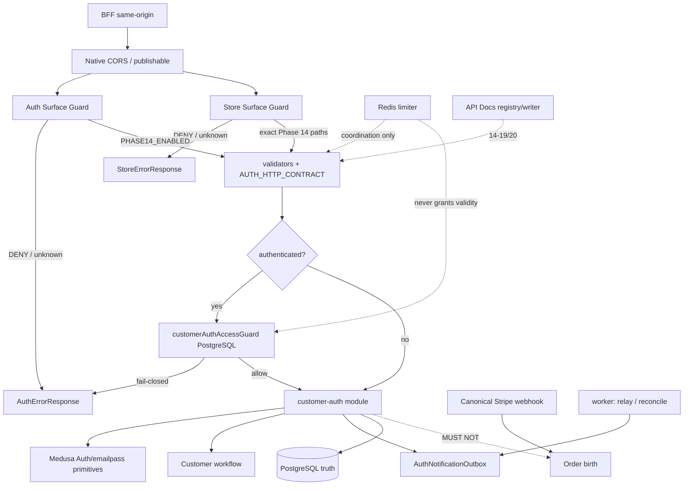

Order-birth positivo permanece exclusivamente no webhook canônico
(`runCreateOrderFromConfirmedPaymentAttemptEntrypoint` — `AS-BUILT`).

BFF-only (`PLAN-DECIDED`):
browser never receives backend session JWT, backend refresh credential,
or internal auth/session capabilities and never calls Medusa directly.
One-time verification/reset capabilities may arrive out-of-band to the
user/browser and are submitted only through the same-origin BFF.
Exact browser↔BFF transport is `FUTURE OWNER-PHASE`.
Backend success/error responses never return those one-time capabilities.
AuthSessionEnvelope remains server-to-server.

---

## 2. Module map

Owner `customer_auth` salvo onde o PLAN aponta `api/` ou `jobs/` ou `api-docs/`.

| Área | Paths planejados | Owner plan |
|---|---|---|
| security/email-normalization | `apps/backend/src/modules/customer-auth/security/email-normalization.ts` | 14-04 |
| security/capabilities | `.../security/capabilities.ts` | 14-04 |
| security/rate-limit | `.../security/rate-limit.ts` | 14-08 |
| security/timing | `.../security/timing.ts` | 14-08 |
| models/* | RegistrationIntent, AuthCredentialState, AuthSessionLineage, AuthRefreshCredential, AuthVerificationIntent, AuthResetIntent, AuthNotificationOutbox | 14-05, 14-06 |
| service | `.../service.ts` + migration CLI | 14-07 |
| registration | `.../registration.ts` / coordinator | 14-14 |
| session | `.../session.ts` | 14-10 |
| jwt | `.../jwt.ts` | 14-10 |
| access-guard | `customerAuthAccessGuard` | 14-11 |
| verification | `.../verification.ts` | 14-12 |
| reset | `.../reset.ts` | 14-16 |
| password-change | `.../password-change.ts` | 14-17 |
| notification-outbox | `.../notification-outbox.ts` | 14-09 |
| notification-recipient | `.../notification-recipient.ts` | 14-09 |
| auth-email-templates | `.../auth-email-templates.ts` | 14-09 |
| jobs/auth-notification-relay | `apps/backend/src/jobs/auth-notification-relay.ts` | 14-09 |
| jobs/auth-notification-reconcile | `apps/backend/src/jobs/auth-notification-reconcile.ts` | 14-09 |
| jobs/auth-reset-reconcile | `apps/backend/src/jobs/auth-reset-reconcile.ts` | 14-16 / 14-18 |
| jobs/auth-credential-operation-reconcile | `apps/backend/src/jobs/auth-credential-operation-reconcile.ts` | 14-18 |
| auth-surface/contracts | `apps/backend/src/api/auth-surface/contracts.ts` | 14-02 |
| auth-surface/validators | `.../validators.ts` | 14-02 |
| auth-surface/errors | `.../errors.ts` | 14-02 |
| auth-surface/manifest | `.../manifest.ts` | 14-02 |
| auth-surface/guard | `.../guard.ts` | 14-02 |
| Store/auth routes | `api/store/customers/**`, `api/auth/customer/emailpass/**`, `api/auth/token/refresh` | 14-11, 14-13, 14-15, 14-16, 14-18 |
| API Docs registry | `apps/backend/src/api-docs/**` | 14-19 |
| API Docs writer | generated `store.openapi.json` only | 14-20 |
| Wave 0 harness | helpers + foundation specs | 14-01 |
| transaction probe | `customer-auth-transaction-compatibility.ts` | 14-03 |

Nenhuma oitava autoridade persistente. Campos de operação de credencial vivem em `AuthCredentialState`.

---

## 3. Persistence architecture

Sete responsabilidades (`PLAN-DECIDED` P14-D03). Owner lógico: `customer_auth`. IDs Medusa são vínculos lógicos; **sem** acesso direto a tabelas core. Este SDD **não** escreve SQL/migration. DB_MODEL é reconciliado em **14-03** (`PLAN-DECIDED` P14-D04); o documento atual **não** materializa estes estados (`AS-BUILT`).

TTLs: Registration 24h, verification 30m, reset 15m, access 10m, refresh inactivity 7d, recovery 45s, absolute 30d, outbox/reconciler lease 2m (`PLAN-DECIDED` P14-D05).

### 3.1 RegistrationIntent

| Aspecto | Contrato |
|---|---|
| purpose | coordenar identity+Customer; recuperar parcial; rejeitar mismatch sem overwrite |
| logical owner | `customer_auth` |
| logical key | `normalized_email_hash` ativo |
| relationships | `auth_identity_id`, `customer_id` lógicos |
| states | `pending_identity`, `pending_customer`, `completed`, `expired`, `failed_reconcilable` |
| uniques | um intent **ativo** por hash; identity/customer únicos quando setados |
| CAS/version | `version` no claim/transição |
| row locking | lock da row ativa por hash antes de register/Customer |
| TTL | 24h; expirado não reutilizado |
| indexes | hash ativo; `status+expires_at`; identity/customer |
| cleanup | expire then operational purge; IDs sanitizados |
| hash/key_version | `normalized_email_hash`; payload HMAC **sem senha**; `schema_version` |
| PII | minimizada; e-mail como hash |
| forbidden plaintext | password, fingerprint, capability; plaintext email never in logs/telemetry/Sentry |

### 3.2 AuthCredentialState

| Aspecto | Contrato |
|---|---|
| purpose | `email_verified_at`, `credential_version` monotônico, revoke global, **e** operação genérica reset\|password_change |
| logical key | `auth_identity_id` 1:1 |
| states | recovery `stable` vs in-flight; `email_verified_at` null/set |
| uniques | unique identity; unique `operation_id` quando bound |
| CAS/version | `credential_version`; `operation_version` |
| row locking | lock identity para bump/claim |
| TTL | sem TTL de row; lease de operação 2m |
| indexes | identity; `(operation_status, next_retry_at)` |
| hash/key_version | `operation_id` = HMAC(Idempotency-Key) |
| forbidden plaintext | password, fingerprint, capability |
| operation fields (não são 8ª tabela) | `operation_type reset\|password_change`; `operation_id/status/version`; `lease_owner/until`; `attempt_count/next_retry_at`; markers `provider_proved_at`, `credential_updated_at`, `revocation_committed_at`, `completed_at`; password-change: `current_password_verified_at` |

CHECKs impedem proof/update/completion sem predecessores.

### 3.3 AuthSessionLineage

| Aspecto | Contrato |
|---|---|
| purpose | sessão lógica inicial; teto absoluto; exceção unverified só nesta lineage |
| logical key | opaque `id` (`sid` no JWT) |
| relationships | identity/customer; 1:N refresh credentials |
| states | `active`, `revoked`, `expired` |
| uniques | unique `id`; muitas lineages por identity ao longo do tempo |
| CAS/version | snapshot `credential_version` na emissão |
| row locking | lock em rotate/replay/global revoke |
| TTL | `absolute_expires_at` = original + 30d **imutável** |
| indexes | identity+status; `absolute_expires_at`; `sid` |
| forbidden plaintext | tokens |

### 3.4 AuthRefreshCredential

| Aspecto | Contrato |
|---|---|
| purpose | opaque refresh uso único; N→N+1; recovery 45s; replay family revoke |
| logical key | `token_hash` SHA-256 de 32 bytes CSPRNG |
| relationships | `lineage_id`; `replacement_id` → N+1; `generation` monotônica |
| states | `active`, `consumed`, `replayed`, `revoked` |
| uniques | unique hash; unique `(lineage_id, generation)`; **partial unique: uma `active` por lineage** |
| CAS/version | consume N + insert N+1 na mesma transação **intra-módulo** |
| row locking | `SELECT … FOR UPDATE` em N |
| TTL | inactivity 7d capped by 30d; `recovery_until` = commit + 45s |
| hash/key_version | SHA-256; `request_key_hash`; nonce + `key_version` |
| forbidden plaintext | refresh capability (rederive in-memory) |

### 3.5 AuthVerificationIntent

| Aspecto | Contrato |
|---|---|
| purpose | latest-wins / one-winner; hash-only; **não autentica** |
| logical key | `(auth_identity_id, generation)` + unique `token_hash` |
| states | model-declared (14-06): `pending`, `claimed`, `confirmed`, `superseded`, `expired`, `dead_letter` |
| uniques | unique hash; **um pending/claimed por identity**; generation monotônica |
| CAS/version | update condicional hash+pending+expiry |
| row locking | identity lock no resend |
| TTL | 30m |
| hash/key_version | SHA-256; nonce; `key_version` |
| forbidden plaintext | verification capability; native `code` |

`AuthVerificationIntent.dead_letter` is a **reserved model state** inherited from the approved 14-06 model contract. No Phase 14 runtime transition caused by provider-delivery failure is authorized to move a verification intent into this state. No implementation path may use this state to invalidate an otherwise pending verification capability unless a later separately approved contract defines such a transition. Provider delivery exhaustion MUST NOT transition `AuthVerificationIntent.status` → `dead_letter`. Provider delivery dead-letter belongs exclusively to `AuthNotificationOutbox.status = dead_letter`. For verification delivery exhaustion, the intent remains `pending` and confirmable until successful confirm, TTL expiry, or resend/supersede. Confirm CAS remains `hash+pending+expiry`; provider delivery status MUST NOT participate in capability validity. Status público: `pending|verified`.

### 3.6 AuthResetIntent

| Aspecto | Contrato |
|---|---|
| purpose | latest-wins + sucesso composto |
| logical key | `(auth_identity_id, generation)`; unique hash; unique `operation_id` |
| states | `pending`, `claimed`, `credential_updated`, `revocation_committed`, `completed`, `superseded`, `expired`, `failed_reconcilable` |
| uniques | um pending/claimed ativo por identity |
| CAS/version | claim liga HMAC(Idempotency-Key); `completed` iff updated **and** revoked |
| row locking | lock intent antes de claim/consume/provider/write |
| TTL | 15m |
| forbidden plaintext | reset capability, `newPassword` |

### 3.7 AuthNotificationOutbox

| Aspecto | Contrato |
|---|---|
| purpose | sibling de Order `EmailDeliveryLog`; delivery durável sem capability persistida |
| logical key | idempotency `auth/{template}/{intentId}/g{generation}` ≤256 |
| relationships | intent+generation; `recipient_identity_id` **opaco obrigatório** |
| states | `recorded`, `claimed`, `sent`, `failed`, `dead_letter` |
| uniques | unique idempotency; `provider_message_id` sanitizado unique quando set |
| CAS/version | claim owner/lease/`version` CAS |
| row locking | conditional update; um claimant |
| TTL | lease 2m; backoff 1m/5m/30m/2h/6h/12h; dead-letter na 6ª falha; batch 25 |
| indexes | `(status, next_retry_at)`; lease; idempotency |
| hash/key_version | `recipient_hash` + `recipient_domain`; `key_version` |
| PII | domínio + hash; **sem coluna de e-mail** |
| forbidden plaintext | e-mail, body, capability, URL, metadata arbitrária |

Templates: `email_verification_v1`, `password_reset_v1`. Record na **mesma transação custom** do intent (intra-módulo, não o seam 14-03).

---

## 4. State machines

### 4.1 RegistrationIntent

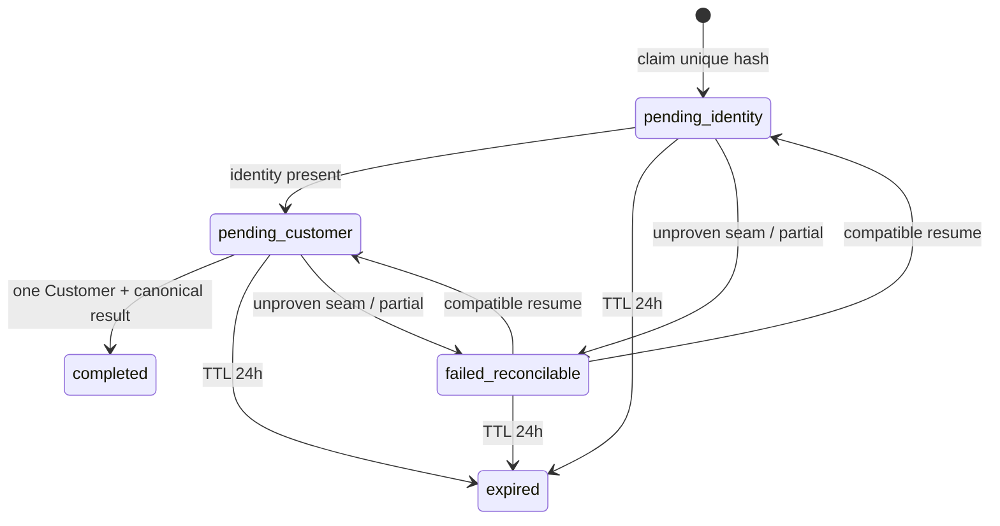

Mismatch: **zero write**.

### 4.2 AuthSessionLineage

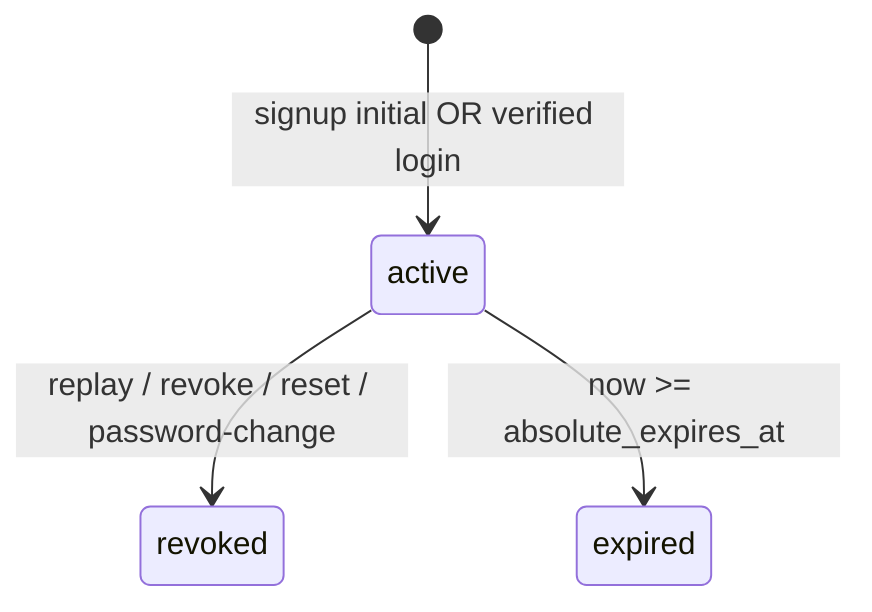

Refresh **não** muda status nem deadline.

### 4.3 AuthRefreshCredential

```mermaid
stateDiagram-v2
  [*] --> active: issue generation N
  active --> consumed: rotate; create N+1
  consumed --> consumed: same key <=45s unused descendant: SAME N+1
  consumed --> replayed: other key OR >45s OR descendant used
  replayed --> revoked: lineage + descendants
  active --> revoked: lineage revoke
```

### 4.4 AuthVerificationIntent

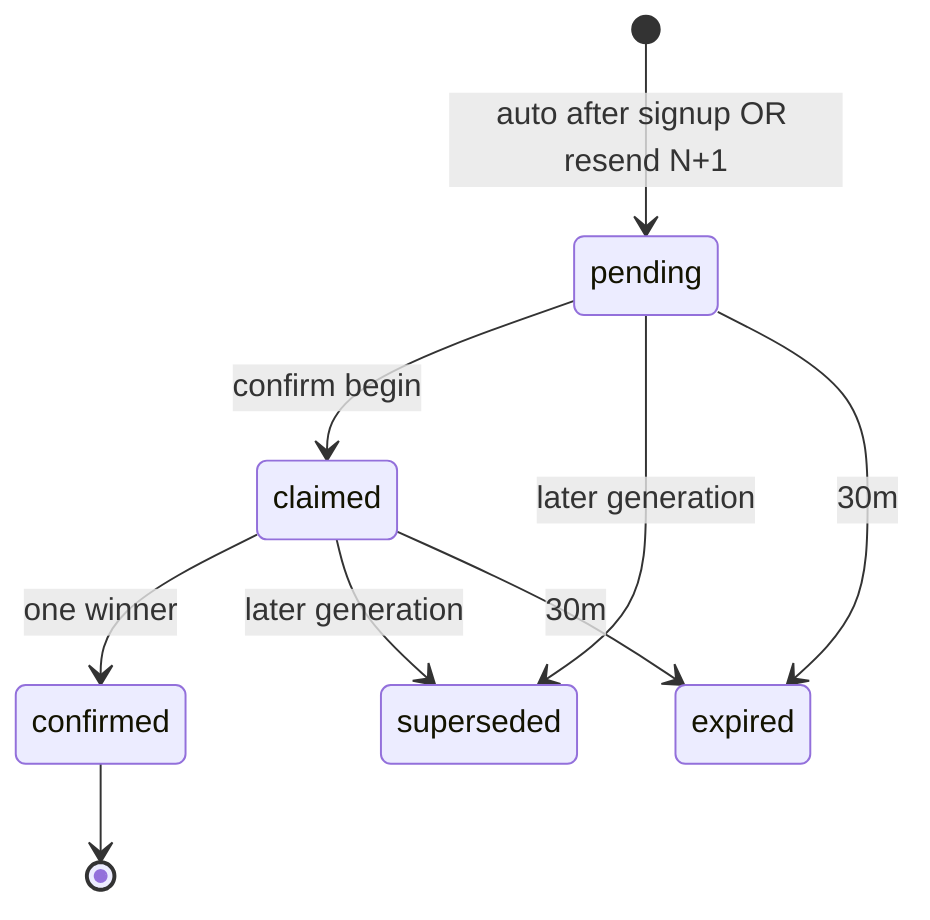

Provider delivery: `pending` remains `pending`. `AuthNotificationOutbox` may become `dead_letter`. No Phase 14 runtime transition `pending → dead_letter` on `AuthVerificationIntent`.

### 4.5 AuthResetIntent

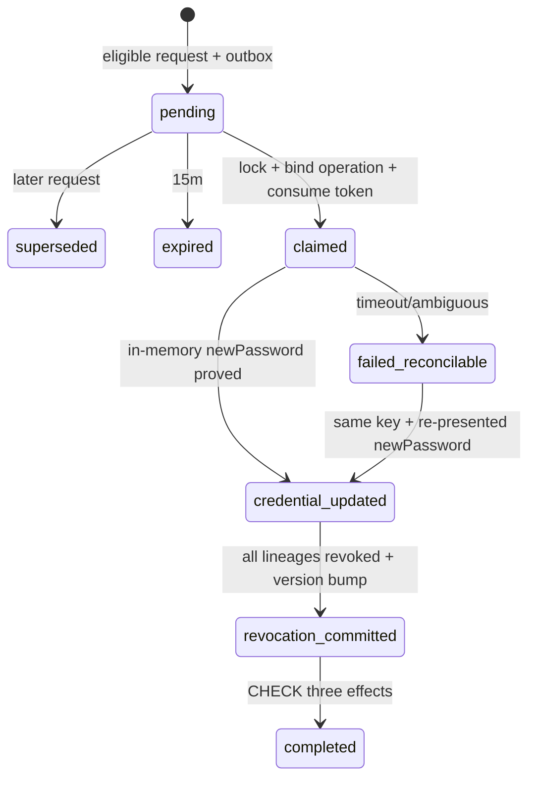

### 4.6 Credential operation (campos de AuthCredentialState)

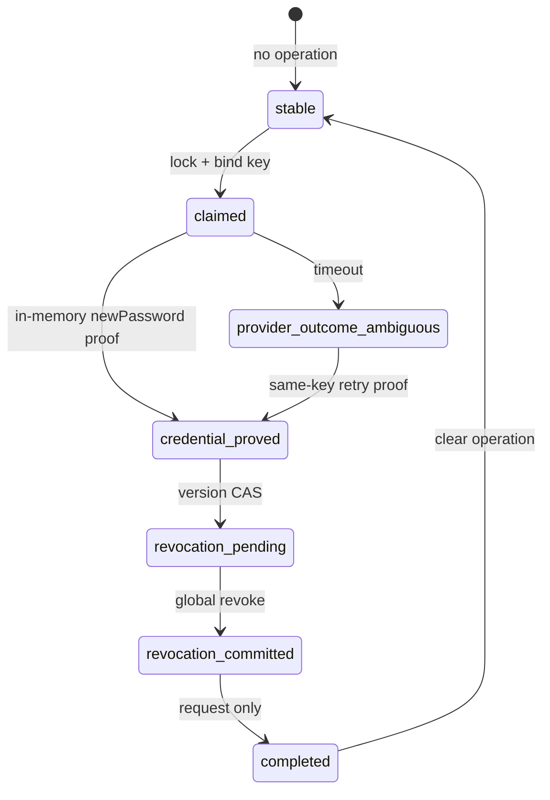

Login/refresh/access exigem `recovery = stable`, exceto resume-only de password-change na **mesma** rota.

---

## 5. Transaction architecture

```text
PostgreSQL is authority
Redis is coordination only
```

### 5.1 Execution-time transaction probe (14-03)

O spike classifica **cada** seam independentemente:

1. custom row + Auth provider update
2. custom row + Customer workflow
3. custom row + ambas

Export: `CustomerAuthTransactionCapability = SUPPORTED_STRONG | RECONCILIATION_REQUIRED`.

**Este SDD não escolhe o vencedor.**

### 5.2 Branch `SUPPORTED_STRONG`

- Somente se fault rollback remover **todos** os writes custom **e** Medusa sob o **mesmo** transaction manager.
- Duas transações correlacionadas **não** são atomicidade.
- Somente seams **realmente provadas** podem compartilhar transaction manager.
- Seams não provadas permanecem na branch B.

### 5.3 Branch `RECONCILIATION_REQUIRED`

- State machine fail-closed; **sem** claim de atomicidade cross-module.
- Estados intermediários de **operação de credencial** (`claimed` / `provider_outcome_ambiguous` / `credential_updated` / recovery não-`stable`) **bloqueiam** login/refresh até resume compatível (`PLAN-DECIDED` 14-03: `claimed|credential_updated`).
- RegistrationIntent `pending_identity` / `pending_customer` / `failed_reconcilable` **não** aplica esse bloqueio. Login dessas identidades usa dummy/`401` (SPEC §5). Recovery é retry de signup.
- Retries + reconciler convergem; reconciler secretless **não** prova senha.
- **Baseline válido** se strong não for provada.

### 5.4 Intra-módulo (não é o fato 14-03)

Transações PostgreSQL **dentro** de `customer_auth` são `PLAN-DECIDED`:

- intent + outbox record
- refresh: lock N, consume N, insert N+1
- verification resend/confirm latest-wins
- lineage revoke + `credential_version` bump (rows custom)

Isso **não** autoriza a frase “all auth changes are atomic”.

---

## 6. Signup sequence

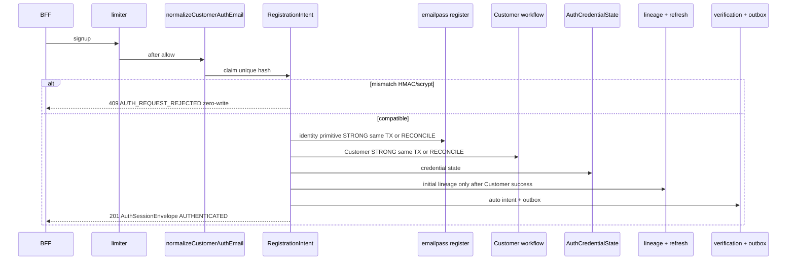

Faults: identity-without-Customer → `pending_customer` / `failed_reconcilable` (24h). Concorrência → um Customer. Provider e-mail independente. Zero Order.

---

## 7. Login sequence

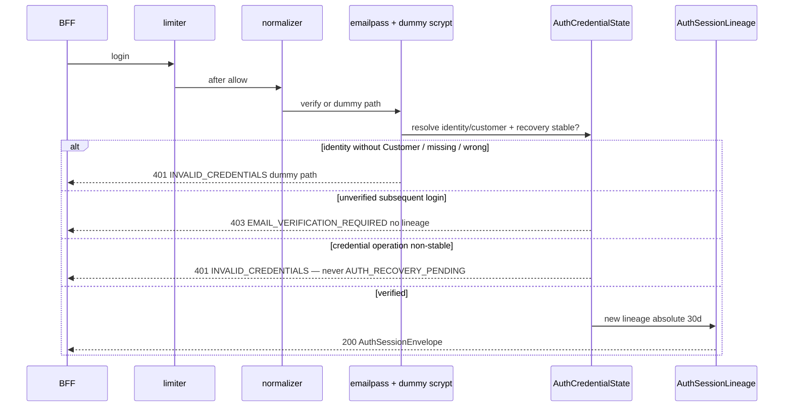

---

## 8. Refresh sequence

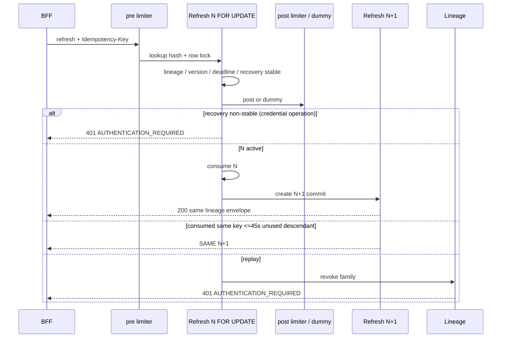

Crash pre-commit: N permanece `active`. Crash pós-commit: recovery pelo protocolo fechado.

---

## 9. Access guard

```text
1. verify JWT crypto (sig, exp, type) — necessary, not sufficient
2. load PostgreSQL lineage + AuthCredentialState
3. ownership identity + customer
4. credential version match
5. now < absolute_expires_at
6. recovery stable
7. allow or fail closed
```

Redis cache **não** autoriza. Outage de DB → deny. Exceção: resume-only de password-change na mesma rota (14-17).

---

## 10. Verification sequence

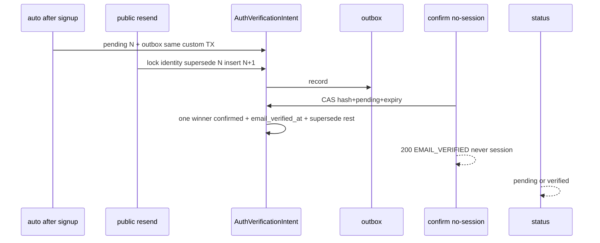

Latest-wins no resend; one-winner no confirm. Native Event Bus **não** transporta capability. One-time verification capability MAY arrive out-of-band to the user/browser and is submitted only through the same-origin BFF. Confirm remains no-session at the backend; the browser never calls Medusa directly. Backend success/error responses never return the capability. Exact browser↔BFF transport is `FUTURE OWNER-PHASE`.

---

## 11. Auth notification outbox

`PLAN-DECIDED` P14-D10.

1. Record na mesma transação custom do intent.
2. CAS claim: owner + lease 2m + version; um claimant.
3. Resolver `recipient_identity_id` via Query graph / module API.
4. `normalizeCustomerAuthEmail`; HMAC recipient; `timingSafeEqual`.
5. Match → rederivar capability **em memória**; chamar provider; persistir `provider_message_id` sanitizado.
6. Missing/mismatch → `AuthNotificationOutbox.status = dead_letter` `RECIPIENT_MISSING|RECIPIENT_MISMATCH` + alerta sanitizado; **sem** provider call. `AuthVerificationIntent` remains `pending`.
7. Fail → backoff 1m/5m/30m/2h/6h/12h; 6ª → `AuthNotificationOutbox.status = dead_letter`; reclaim de lease expirado. Provider delivery exhaustion MUST NOT transition `AuthVerificationIntent.status` → `dead_letter`.
8. Idempotency estável `auth/{template}/{intentId}/g{generation}`.
9. Native Event Bus capability transport **não usado**.

---

## 12. Reset sequence

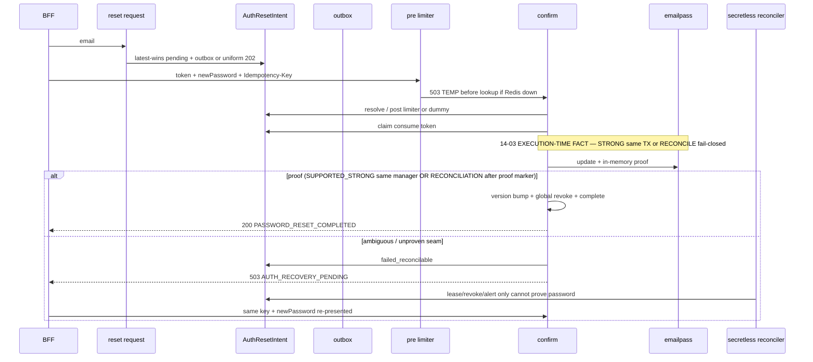

Dois 503: `AUTH_TEMPORARILY_UNAVAILABLE` (Redis, pré-lookup) vs `AUTH_RECOVERY_PENDING` (mesma operation/Idempotency-Key já ambígua). One-time reset capability MAY arrive out-of-band to the user/browser and is submitted only through the same-origin BFF. It never authorizes direct browser → Medusa requests. Backend success/error responses never return the capability. Exact browser↔BFF transport is `FUTURE OWNER-PHASE`.

---

## 13. Password-change sequence

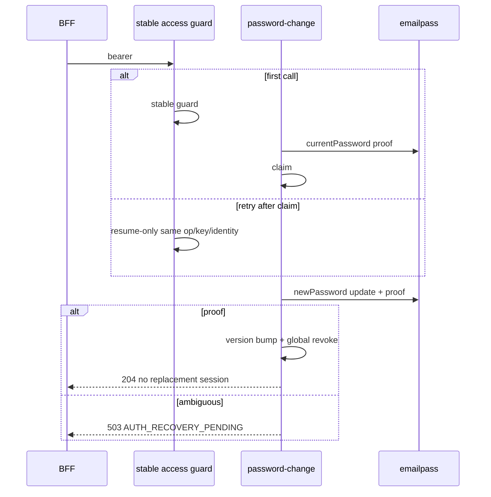

Wrong current → zero-write `400 CURRENT_CREDENTIAL_INVALID`. Unverified stays unverified. Surface enablement somente em 14-18.

---

## 14. Rate limit architecture

`PLAN-DECIDED` P14-D11. Keys HMAC com `key_version`; IP/token/IDs nunca na key.

| operation | pre bucket | post bucket | dummy bucket | threshold | public limit | Redis outage | timing class |
|---|---|---|---|---|---|---|---|
| signup | IP + email | — | — | 5/IP/15m + 3/email/h | 429 | 503 Retry-After 60 before lookup/write | limiter-before-lookup |
| login | (IP,email) + IP | — | dummy scrypt | 10/(IP,email)/15m + 30/IP/15m | 429 | 503 before lookup | dummy scrypt equivalent |
| reset request | email + IP | — | no intent on limit/outage | 3/email/h + 10/IP/h | 202 uniforme | absorbed 202 | anti-enum 202 |
| public resend | email + IP | after eligible | post-dummy ineligible | 3/email/h + 10/IP/h | 202 uniforme | absorbed 202 | anti-enum 202 |
| verification request | IP + HMAC(lineage) after guard | — | — | 3/lineage/h + 10/IP/h | 429 | 503 before lookup/write | not 350ms class |
| verification confirm | 10/(IP,token)/15m | 10/(IP,intent)/15m | post dummy missing/malformed | same | 429 / 400 VERIFICATION_INVALID_OR_EXPIRED | 503 before lookup | 350ms + jitter 0..50; 40 samples; median ≤50; p95 ≤75 |
| reset confirm | 30/IP/15m + 10/(IP,presented-token)/15m | 10/(IP,reset-intent)/15m | dummy post from pre-digest | same | 400 RESET_INVALID_OR_EXPIRED / 429 / two 503s | 503 TEMP **before** lookup/claim/consume/provider/write | same 350ms class |
| refresh | 60/IP/15m + 10/(IP,presented-refresh)/min | 10/lineage/min | post dummy missing/malformed | same | 429 / 401 | 503 before lookup | same 350ms class |
| password change | 5/lineage/h after guard | — | — | 5/lineage/h | 429 | 503 before lookup/mutation | not 350ms class |

---

## 15. Surface architecture

Staged enablement (`PLAN-DECIDED` P14-D13):

| Plano | Auth | Store |
|---|---|---|
| 14-02 | 24/24 DENY (18 nativas + 6 locais) | customers continuam DENY |
| 14-11 | custom refresh + revoke `PHASE14_ENABLED`; native refresh DENY | request/status/me/password ainda DENY |
| 14-13 | native verification DENY | 4 verification paths elevated |
| 14-15 | signup + login enabled | `GET /store/customers/me` elevated; raw POST customers DENY |
| 14-16 | reset request + confirm overrides enabled | — |
| 14-17 | — | password handler **DENY** |
| 14-18 | exact-set auth final | password path final enablement |

Raw/native incompatíveis continuam DENY: `/auth/session`, callback, MFA, native verification/refresh/reset, `POST /store/customers`, aliases.

---

## 16. API Docs architecture

Separação (`PLAN-DECIDED` P14-D13/D14):

| Camada | Owner | Regra |
|---|---|---|
| runtime contract | 14-02 + handlers | AUTH_HTTP_CONTRACT |
| TypeScript registry | **14-19 only** | sem JSON gerado |
| generated JSON | **14-20 only** | writer Store; Admin/Webhooks byte-iguais; sem edição manual |
| clean check | 14-21 | `openapi:check` em checkout limpo **depois** do writer |

Exemplos sintéticos; sem credenciais, tokens, Pix, tracking, IDs de provedor ou PII. Swagger não interativa.

---

## 17. Observability / security architecture

**Allowlist:** `correlationId`; opaque operation/intent/lineage/outbox IDs; `generation`; transition; allowlisted `reason`; `attempt`; `template`.

**Proibir:** plaintext email in application logs, telemetry, Sentry, Redis, OpenAPI examples, and durable AuthNotificationOutbox; password; access token; refresh token; verification token; reset token; `Authorization`; cookie; provider raw payload; capability URL; token hash como Redis key.

Plaintext email MAY exist transiently in request/provider resolution memory when required by the approved flow. Existing Customer/Auth provider storage is not redefined here.

Browser MUST NOT receive backend access JWT, backend refresh capability, internal lineage/session/auth capabilities, or provider/internal auth state. One-time verification/reset capabilities MAY arrive out-of-band to the user/browser and are submitted only through the same-origin BFF. The browser never calls Medusa directly.

---

## 18. Failure matrix

| failure | authoritative state | public response | retry/reconcile | forbidden side effect | evidence |
|---|---|---|---|---|---|
| Redis outage (mutating/auth ops) | unchanged; no lookup | `503 AUTH_TEMPORARILY_UNAVAILABLE` Retry-After 60 | client retry | no claim/provider/write | V14-LIM |
| Redis outage (public reset/resend) | no intent/outbox | `202 REQUEST_ACCEPTED` | n/a | no distinguishable header | V14-LIM |
| PostgreSQL outage | unchanged | fail-closed 401/503 generic | no grant | Redis must not authorize | V14-SES |
| provider timeout (email notification) | AuthVerificationIntent remains pending; AuthNotificationOutbox may retry or `dead_letter` | signup public envelope **unchanged** (D14-09) | outbox backoff | no revert of Customer/session; no AuthVerificationIntent.status → dead_letter | V14-OUT, V14-REG |
| provider timeout (identity/Customer seam) | `failed_reconcilable` / pending_* | closed 14-02 class (`409`/`503` as applicable); no native leak | compatible signup resume | no duplicate Customer; no Order | V14-REG |
| signup identity/customer split | pending_customer recoverable 24h | generic; no partial oracle | compatible retry | no password overwrite | V14-REG |
| refresh crash pre-commit | N still active | client retry | same key recovery n/a yet | no N+1 | V14-SES |
| refresh lost response post-commit | N consumed, N+1 unused | SAME N+1 ≤45s same key | closed protocol | never N+2 | V14-SES |
| refresh replay | lineage revoked | `401 AUTHENTICATION_REQUIRED` | re-auth | no grant of descendant | V14-SES |
| verification concurrent resend | one pending generation | uniform 202 | latest-wins | two valid tokens forbidden | V14-VER |
| verification concurrent confirm | one confirmed winner | 200 vs 400 equivalent | n/a | no session/JWT | V14-VER |
| outbox ambiguous provider | outbox failed/retry; intent pending | business state unchanged | CAS reclaim | no capability in Redis/DB | V14-OUT |
| reset ambiguous provider | `failed_reconcilable`; login/refresh blocked | `503 AUTH_RECOVERY_PENDING` | same-key + newPassword; secretless cannot complete | no session; unverified stays | V14-RST |
| password change ambiguous | operation in-flight; ordinary access blocked | `503 AUTH_RECOVERY_PENDING` | resume-only same op | no replacement session | V14-CHG |
| worker crash | lease expires 2m | n/a | reclaim CAS | no double send without idempotency | V14-OUT |
| stale lease | previous owner lost | n/a | new claimant | one claimant | V14-OUT / V14-CHG |
| absolute session expiry during checkout | lineage expired; cart/checkout persist | authenticated 401 | verified re-auth | webhook may still create Order | V14-NEG |

---

## 19. Validation architecture

Mapeamento **exato** de `14-VALIDATION.md`. Nenhum comando novo. **Nenhuma execução agora.**

### 19.1 Wave 0 (`APPROVED TARGET`; arquivos ainda inexistentes)

- `apps/backend/src/modules/customer-auth/__tests__/support/deterministic-auth.ts`
- `apps/backend/src/modules/customer-auth/__tests__/auth-validation-foundation.unit.spec.ts`
- `apps/backend/integration-tests/helpers/auth-postgres.ts`
- `apps/backend/integration-tests/helpers/auth-redis.ts`
- `apps/backend/integration-tests/helpers/auth-multiprocess.ts`
- `apps/backend/integration-tests/helpers/auth-providers.ts`
- `apps/backend/integration-tests/helpers/auth-faults.ts`
- `apps/backend/integration-tests/helpers/auth-leakage.ts`
- `apps/backend/integration-tests/modules/auth-validation-foundation.spec.ts`

### 19.2 11 isolated PostgreSQL processes

Ledger serial; um spec por processo; stop-on-first-failure; 11/11 cleanup.

1. `auth-validation-foundation.spec.ts`
2. `customer-auth-transaction-compatibility.postgres.spec.ts`
3. `customer-auth-email-collision.postgres.spec.ts`
4. `customer-auth-models.postgres.spec.ts`
5. `auth-notification-outbox.postgres.spec.ts`
6. `auth-session.postgres.spec.ts`
7. `auth-verification.postgres.spec.ts`
8. `auth-registration.postgres.spec.ts`
9. `auth-reset.postgres.spec.ts`
10. `auth-password-change-reconcile.postgres.spec.ts`
11. `auth-order-invariants.postgres.spec.ts`

Prefixo de cada linha: `node apps/backend/scripts/run-disposable-postgres-tests.mjs -- npm run test:integration:modules -w @dtc/backend -- --runTestsByPath integration-tests/modules/<file>`

### 19.3 Focused HTTP

`auth-rate-limit.spec.ts`, `auth-multiprocess.spec.ts`, `auth-verification.spec.ts`, `auth-customer.spec.ts`, `auth-reset.spec.ts`, `auth-password-change.spec.ts`, `auth-contract-matrix.spec.ts`, `auth-security.spec.ts`.

### 19.4 Full phase gate (90 min; serial; stop first failure)

checkout clean + `openapi:check`; quick unit; Focused HTTP; ledger 1–11; regressões Unit/Modules/HTTP; OpenAPI lint; lint; build; negative scans; `git diff --check`.

Order invariant control: zero auth Order; webhook canônico positivo; expiry/revoke preserva checkout.

---

## 20. Plan-to-design map (21/21)

| Plan | SDD components | Requirements | Evidence | Prerequisites |
|---|---|---|---|---|
| 14-01 | Wave 0 harness | AUTH-01..09 | V14-W0 | none |
| 14-02 | auth-surface contracts/guard | AUTH-03,07,09 | V14-CTR | 14-01 |
| 14-03 | DB_MODEL + transaction probe | AUTH-01,04–08 | V14-DB | 14-02 |
| 14-04 | normalizer + capabilities | AUTH-01,04,06,07,09 | V14-DB | 14-03 |
| 14-05 | core models | AUTH-01,02,05,06 | V14-DB | 14-04 |
| 14-06 | intent/outbox models | AUTH-04,07,08 | V14-DB | 14-05 |
| 14-07 | migration/service | AUTH-01,02,04–08 | V14-DB | 14-06 |
| 14-08 | rate-limit/timing | AUTH-01,04,06,07,09 | V14-LIM | 14-07 |
| 14-09 | outbox relay/reconcile | AUTH-07,08,09 | V14-OUT | 14-08 |
| 14-10 | session/jwt/refresh domain | AUTH-02,05,06 | V14-SES | 14-09 |
| 14-11 | access-guard + refresh/revoke HTTP | AUTH-03,05,06 | V14-SES | 14-10 |
| 14-12 | verification domain | AUTH-07,08,09 | V14-VER | 14-11 |
| 14-13 | verification Store HTTP | AUTH-07,09 | V14-VER | 14-12 |
| 14-14 | registration coordinator | AUTH-01,02,09 | V14-REG | 14-13 |
| 14-15 | signup/login/me HTTP | AUTH-01,02,03,09 | V14-REG | 14-14 |
| 14-16 | reset HTTP + SM | AUTH-04,05,09 | V14-RST | 14-15 |
| 14-17 | password-change handler DENY | AUTH-03,05,09 | V14-CHG | 14-16 |
| 14-18 | reconciler + password enablement | AUTH-03,04,05,09 | V14-CHG | 14-17 |
| 14-19 | API Docs registry | AUTH-03,07,09 | V14-DOC | 14-18 |
| 14-20 | API Docs writer | AUTH-03,07,09 | V14-DOC | 14-19 |
| 14-21 | final matrices / Order control | AUTH-01..09 | V14-NEG | 14-20 |

Cadeia acíclica serial. `parallelization=false`.

---

## 21. Research disposition (architecture)

Os 4 blockers e 8 MUST estão mapeados em SPEC §15. No SDD:

| Finding | Component |
|---|---|
| B1 fail-closed surface | auth-surface manifest/guard |
| B2 native refresh | session.ts + custom refresh route |
| B3 composed reset | reset SM + 14-03 branch |
| B4 mutable signup / email | normalizer + RegistrationIntent |
| M1 plaintext event | AuthNotificationOutbox; no Event Bus |
| M2 native confirm race | verification conditional update |
| M3 stale bearer | customerAuthAccessGuard |
| M4 timing oracle | dummy scrypt + timing.ts |
| M5 order-only relay | sibling outbox CAS |
| M6 no global limiter | rate-limit.ts Redis |
| M7 response leak | AUTH_HTTP_CONTRACT allowlist |
| M8 log/OpenAPI leak | leakage collectors + walker |

---

## 22. Governance

```text
SDD complete != implementation authorization
SDD complete != execution authorization
requirements remain incomplete (0/9)
frontend remains blocked
plans executed = 0/21
SPEC/SDD human approval: NOT YET GRANTED
transaction winner: NOT ASSERTED
```

Não iniciar Implementation Prompt, 14-01, runtime, migration, provider, frontend ou deploy.
